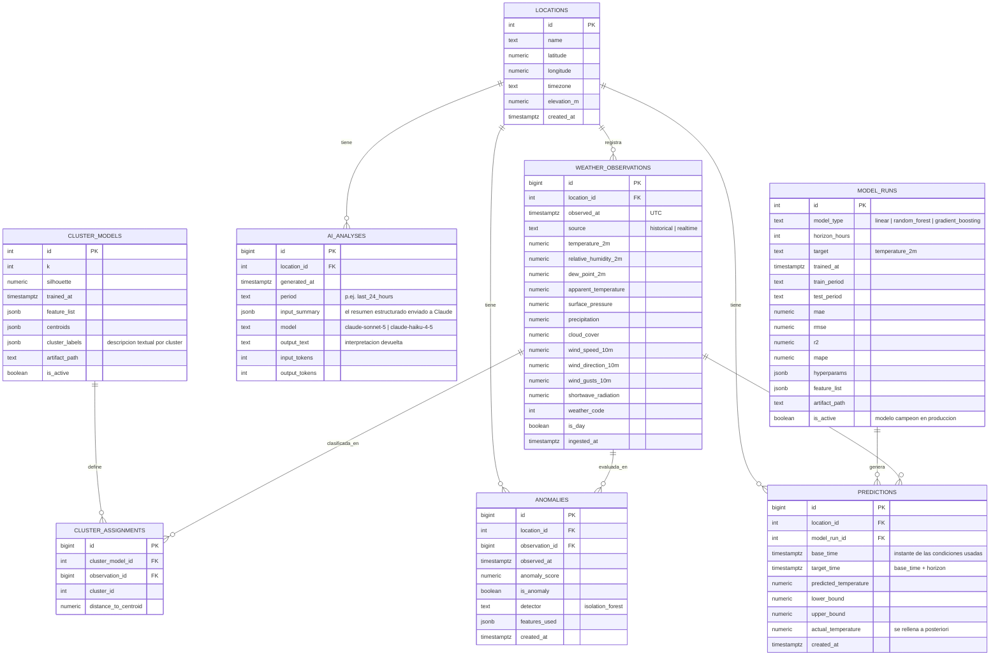

# FASE 1 — Análisis y Arquitectura

**Proyecto:** Weather Intelligence
**Documento:** Diseño general — **Fase 1 APROBADA y decisiones cerradas**
**Fecha:** 2026-09-08
**Metodología:** CRISP-ML(Q)

> Cómo leer este documento: cada bloque grande sigue el orden que pediste para la Fase 1 (20 entregables). Al final hay una sección **"Correcciones de mentor"** con los puntos de tu planteamiento que conviene ajustar antes de escribir código, y un **roadmap de fases** siguientes. No hay código todavía: esto es para que lo revises y lo apruebes o lo corrijas.

---

## 0.0 Decisiones cerradas de Fase 1 (delegadas y resueltas)

La estudiante aprobó los criterios de éxito (§21) y delegó el resto de decisiones ("decídelo tú, depende de si se encuentran datasets y APIs"). Verificado el **2026-09-08** que las fuentes existen y responden (evidencia abajo).

| # | Decisión | Valor cerrado | Verificación |
|---|---|---|---|
| 1 | **Ubicación** | **Madrid‑Barajas (aeropuerto), España.** Lat **40.4936**, Lon **−3.5668**, elevación ~610 m. Estación de referencia Meteostat **08221** (ICAO **LEMD**, WMO 08221). | Open‑Meteo devuelve serie horaria completa para esas coordenadas; estación Meteostat 08221 activa. |
| 2 | **Alcance** | **Una sola ubicación** (el esquema soporta multi‑ubicación; queda como trabajo futuro). | — |
| 3 | **Horizontes de predicción** | **H ∈ {1, 3, 6, 12, 24} horas.** Discusión centrada en 6–24 h; siempre contra *baseline* de persistencia. | — |
| 4 | **Fuente histórica** | **Open‑Meteo Historical (ERA5)**, export único a CSV/Parquet. Periodo **2000‑01‑01 → presente** (~25 años ≈ **225.000 registros horarios**). **Meteostat 08221** como contraste de observación real (opcional, suma en la defensa). | `GET archive-api.open-meteo.com/v1/archive` → 200, datos OK. Meteostat bulk `08221.csv.gz` → **429.884 filas** desde 1931, licencia CC BY 4.0. |
| 5 | **Fuente tiempo real** | **Open‑Meteo Forecast API** (`current` + `hourly`). Sin API key, sin tarjeta, CC BY 4.0. | `GET api.open-meteo.com/v1/forecast?...&current=...` → 200, dato vivo (p. ej. 2026‑09‑08T23:30, temp 22.4 °C, radiación 0 de noche). |
| 6 | **Modelo de Claude** | Por defecto **`claude-haiku-4-5`** ($1 / MTok entrada, $5 / MTok salida, contexto 200K). Opción **`claude-sonnet-5`** solo para la versión "de gala" de la defensa. Configurable por `.env` (`ANTHROPIC_MODEL`). | Precios de la tabla oficial de modelos (caché 2026‑06‑24). |
| 7 | **Presupuesto de créditos Claude** | Coste real estimado **< 3 USD para todo el proyecto** con caché + límite ≤ 1 llamada/hora (cada `/insights` ≈ 1.000 tok entrada + 500 tok salida ≈ **$0.0035/llamada**). **Techo asignado: 15 USD.** | Cálculo con precios de Haiku 4.5. |
| 8 | **Restricciones del curso** | No se indicaron (entrega "lo antes posible", sin tecnología obligatoria, sin formato de informe fijado). Se asume libertad técnica total; el `stack` de §19 queda fijado. Si el curso impone algo, se ajusta en Fase 2. | — |
| 9 | **Criterios de éxito (§21)** | **Aprobados sin cambios.** | — |

**Comando de verificación reproducible** (para el informe, sección *Data Understanding*):

```bash
# Histórico (muestra de 3 días)
curl "https://archive-api.open-meteo.com/v1/archive?latitude=40.4936&longitude=-3.5668&start_date=2020-01-01&end_date=2020-01-03&hourly=temperature_2m,relative_humidity_2m,surface_pressure,wind_speed_10m,shortwave_radiation,precipitation,cloud_cover&timezone=UTC"

# Tiempo real (condiciones actuales)
curl "https://api.open-meteo.com/v1/forecast?latitude=40.4936&longitude=-3.5668&current=temperature_2m,relative_humidity_2m,surface_pressure,wind_speed_10m,shortwave_radiation,precipitation,cloud_cover,apparent_temperature,weather_code,is_day&timezone=UTC"

# Contraste de observación real (Meteostat, estación Madrid-Barajas)
curl -sL "https://bulk.meteostat.net/v2/hourly/08221.csv.gz" | gunzip | head
```

**Sobre la ubicación (justificación de la decisión):** Madrid‑Barajas tiene **estacionalidad anual muy marcada** (inviernos fríos ~2–9 °C, veranos calurosos ~18–34 °C) y **ciclo diario amplio** por su clima continental seco → los regímenes de *clustering* salen nítidos, la des‑estacionalización para anomalías tiene señal fuerte, y el análisis temporal es rico. Además es un **aeropuerto con estación ICAO** (observaciones METAR frecuentes) → excelente cobertura Meteostat para el contraste, y el contexto en español encaja con el proyecto. *Alternativa si tu universidad exige contexto local/colombiano:* Bogotá‑El Dorado (SKBO, 4.70, −74.15); el diseño no cambia, pero la estacionalidad **anual** es casi plana (clima isotérmico ecuatorial) → la "comparación con el histórico" pasaría a apoyarse en el ciclo **diario** y en la temporada seca/húmeda en lugar del ciclo anual. Madrid da mejor narrativa técnica para la defensa.

---

## 0. Resumen ejecutivo (1 párrafo)

Weather Intelligence es una plataforma que aplica un proceso completo de minería de datos y aprendizaje automático sobre datos meteorológicos **históricos** (un dataset estático y grande, usado para entrenar y descubrir patrones) y datos meteorológicos **en tiempo real** (una API que actualiza el sistema de forma continua). Sobre esos datos se ejecutan: ETL y limpieza, análisis exploratorio (EDA), *clustering* (K‑Means) para descubrir regímenes meteorológicos, detección de anomalías (Isolation Forest) sobre residuales sin estacionalidad, y modelos de regresión (Linear Regression, Random Forest, Gradient Boosting) para predecir la temperatura a un horizonte definido, con partición **cronológica** para evitar *data leakage*. Los resultados numéricos se resumen en un objeto estructurado y se envían a la **API de Claude**, que actúa **exclusivamente como capa de interpretación en lenguaje natural** (no es el modelo de ML). Todo se expone mediante una API backend (FastAPI + PostgreSQL) y un dashboard (React + Tailwind + Recharts), orquestado con Docker Compose.

---

## 1. Nombre definitivo del proyecto

- **Nombre de producto / plataforma:** **Weather Intelligence**
- **Título académico sugerido para la portada del informe:**
  *"Weather Intelligence: plataforma de minería de datos y aprendizaje automático para el descubrimiento de patrones, la detección de anomalías y la predicción de temperatura en series meteorológicas, con interpretación asistida por IA generativa."*
- **Alcance geográfico de la versión evaluable:** **una única ubicación — Madrid‑Barajas (40.4936, −3.5668)** (ver §0.0 y §7). El diseño de base de datos y de código soporta múltiples ubicaciones, pero el análisis, los modelos y la defensa se centran en una sola para que los resultados sean profundos y comparables.

**Por qué una sola ubicación:** el clima es local. Mezclar ciudades con climas distintos en un mismo modelo de regresión o en un mismo *clustering* obliga a añadir la ubicación como variable y diluye la interpretación. Para un proyecto universitario defendible, "un caso bien hecho" vale más que "diez casos superficiales". Se documenta como decisión de alcance, no como limitación oculta.

---

## 2. Planteamiento del problema

**Contexto.** Existe una enorme cantidad de datos meteorológicos públicos, históricos y en tiempo real, de alta calidad y libres. Sin embargo, entre "el dato crudo" y "una conclusión útil para una persona" hay un trabajo técnico considerable: adquirir los datos, almacenarlos de forma consistente, limpiarlos, transformarlos, analizarlos estadísticamente, aplicar técnicas de minería de datos y de ML, validar los modelos correctamente (algo especialmente delicado en series temporales) y, finalmente, comunicar los resultados de forma comprensible sin exagerar su certeza.

**Problema concreto.** No se dispone de un sistema integrado y reproducible que:

1. combine una fuente histórica grande con una fuente en tiempo real bajo un mismo esquema de datos;
2. ejecute un pipeline reproducible de preparación, EDA, minería de datos y ML;
3. valide los modelos respetando la naturaleza temporal de los datos (sin *data leakage*);
4. contextualice cada observación nueva frente al histórico (percentiles, régimen, anomalía, predicción);
5. traduzca esos resultados numéricos a lenguaje natural de forma rigurosa, distinguiendo hechos de interpretación.

**Pregunta central.** *¿Es posible construir un sistema que, a partir de datos meteorológicos históricos y actuales, descubra patrones, detecte condiciones inusuales y prediga la temperatura futura con un error acotado y medible, y que además explique sus resultados de forma responsable?*

---

## 3. Justificación

**Académica.** El proyecto recorre de forma completa y explícita la metodología CRISP‑ML(Q) y todas las etapas de un proceso de minería de datos y ML: adquisición, ETL, *data understanding*, *data preparation*, EDA, minería de datos (clustering + detección de anomalías), modelado supervisado con comparación de modelos y métricas, validación temporal correcta, e integración de IA generativa como capa de interpretación. Es material suficiente para una monografía y una defensa.

**Técnica.** Integra un *stack* profesional realista (API REST documentada, base de datos relacional normalizada, contenedores, frontend moderno, separación estricta de responsabilidades, manejo de secretos, logging y tests). Demuestra buenas prácticas que se piden en la industria: reproducibilidad, no *hardcodear* claves, no meter lógica de ML en el frontend, no enviar datasets completos a un LLM.

**Práctica / social.** El resultado es usable: un dashboard que muestra condiciones actuales, cómo se comparan con lo normal, si hay algo inusual y qué predice el modelo, con una explicación en lenguaje natural. Es un patrón transferible a otros dominios (energía, calidad del aire, demanda, finanzas operativas).

**Diferenciador honesto.** No se pretende "predecir el clima mejor que un servicio meteorológico" (eso requiere modelos físicos y supercómputo). Se pretende **demostrar dominio del proceso de minería de datos y ML** sobre un dominio real, con validación correcta y comunicación responsable.

---

## 4. Objetivo general

Construir un sistema inteligente y reproducible capaz de analizar datos meteorológicos históricos y actuales para **descubrir patrones**, **detectar anomalías** y **generar predicciones de temperatura** mediante técnicas de minería de datos y aprendizaje automático, complementando la presentación de los resultados con una capa de interpretación basada en inteligencia artificial generativa, bajo la metodología CRISP‑ML(Q).

---

## 5. Objetivos específicos

1. **Adquirir e integrar** dos fuentes de datos meteorológicos (un dataset histórico ≥ 50.000 registros reales y una API en tiempo real) bajo un esquema de datos común en PostgreSQL, mediante un proceso ETL reproducible.
2. **Caracterizar y documentar** los datos (*data understanding*): volumen, variables, tipos, faltantes, duplicados, valores inválidos, rangos, distribuciones y estructura temporal; producir un **diccionario de datos**.
3. **Construir un pipeline de preparación** reproducible: limpieza, tratamiento de faltantes y valores inválidos, tipado, normalización cuando aplique, y *feature engineering* (variables temporales y derivadas), justificando cada transformación.
4. **Realizar un EDA completo**: análisis univariado, bivariado, temporal y de correlaciones, con interpretación escrita y advertencia explícita de que correlación ≠ causalidad.
5. **Aplicar minería de datos no supervisada**: *clustering* con K‑Means, determinando *k* con Elbow + Silhouette, e interpretar cada *cluster* como un régimen meteorológico surgido de los datos.
6. **Implementar detección de anomalías** con Isolation Forest sobre datos des‑estacionalizados, distinguiendo "registro normal" de "registro potencialmente anómalo" sin afirmar causas físicas.
7. **Entrenar y comparar modelos de regresión** (Linear Regression, Random Forest, Gradient Boosting, y *baselines* de persistencia y estacional) para predecir la temperatura a un horizonte definido.
8. **Validar los modelos con partición cronológica** (70/15/15 en orden temporal) y validación cruzada de series temporales, evitando *data leakage*; seleccionar el modelo final mediante un procedimiento explícito y medible (MAE, RMSE, R², MAPE).
9. **Contextualizar cada observación nueva** frente al histórico: percentiles por variable (controlados por estacionalidad), régimen (*cluster*) más parecido, puntuación de anomalía y predicción, con una estimación de incertidumbre.
10. **Integrar la API de Claude** como capa de interpretación: construir un resumen estructurado acotado, obtener de Claude un texto que distinga hechos de interpretación, y persistir el resultado.
11. **Exponer una API backend** documentada con OpenAPI/Swagger que sirva: clima actual, histórico, estadísticas, anomalías, *clusters*, predicciones, métricas del modelo, análisis de IA y un resumen de dashboard.
12. **Desarrollar un dashboard** React + Tailwind responsive con visualizaciones interactivas de las 8 vistas requeridas.
13. **Diseñar una estrategia de actualización en tiempo real** (ingesta periódica + notificación al frontend) y una **estrategia de reentrenamiento** sencilla con criterio de promoción de modelo.
14. **Empaquetar el sistema con Docker Compose** y documentar su ejecución, con manejo de variables de entorno, CORS, validación, manejo de errores, logging y pruebas.
15. **Producir la documentación académica** completa (problema, metodología, arquitectura, resultados, conclusiones, limitaciones y trabajo futuro).

---

## 6. Preguntas de investigación

Se reformulan tus preguntas como preguntas de investigación con la técnica que las responde y, cuando aplica, una hipótesis:

| # | Pregunta de investigación | Técnica que la responde | Hipótesis / expectativa |
|---|---|---|---|
| P1 | ¿Qué patrones y ciclos meteorológicos aparecen en el histórico de la ubicación? | EDA temporal (descomposición estacional, agregados por hora/mes) | Fuerte ciclo diario y anual en temperatura. |
| P2 | ¿Qué relación existe entre temperatura y humedad relativa? | EDA bivariado + correlación de Pearson/Spearman | Correlación negativa moderada (aire más cálido → menor humedad relativa a igual humedad absoluta). |
| P3 | ¿Qué variables tienen mayor relación (lineal y no lineal) con la temperatura? | Matriz de correlación + importancia de variables del Random Forest | Radiación/hora solar, humedad y presión entre las más informativas. |
| P4 | ¿Cuáles son las condiciones meteorológicas "normales" de la ubicación? | Estadística descriptiva + percentiles **por mes/estación** | Rango intercuartílico por estación como definición operativa de "normal". |
| P5 | ¿Qué condiciones pueden considerarse potencialmente anómalas? | Isolation Forest sobre residuales des‑estacionalizados | ~1–5 % de registros marcados según *contamination* elegido. |
| P6 | ¿Se pueden agrupar las condiciones meteorológicas en regímenes? | K‑Means + Elbow + Silhouette | 3–6 regímenes interpretables. |
| P7 | ¿Se puede predecir la temperatura futura a un horizonte H con error acotado? | Regresión supervisada + validación temporal | Sí para H corto (≤ 24 h); el error crece con H. |
| P8 | ¿El modelo supera a un *baseline* trivial de persistencia? | Comparación de RMSE/MAE contra *baseline* | El modelo debe ganar al *baseline* de forma medible para H ≥ ~3 h. |
| P9 | ¿Qué tan diferente es el clima actual respecto al histórico comparable? | Percentiles condicionados a la época del año | Depende del momento; se reporta con su percentil. |
| P10 | ¿A qué régimen histórico se parece más la situación actual? | Asignación al *cluster* K‑Means más cercano | Se reporta *cluster* + distancia al centroide. |

---

## 7. Dataset histórico recomendado

### 7.1 Recomendación principal: Open‑Meteo Historical Weather API (reanálisis ERA5), exportado una vez a CSV

**Idea:** descargar **una sola vez** ~25–40 años de datos **horarios** para la ubicación elegida desde el *endpoint* histórico de Open‑Meteo, guardarlos como archivo(s) CSV/Parquet, y tratar ese archivo como el "dataset histórico estático" del proyecto (versionado, con *hash*, documentado). La ingesta en tiempo real usa **otro** *endpoint* del mismo proveedor.

| Atributo | Detalle |
|---|---|
| **Fuente** | Open‑Meteo Historical Weather API, basada en el reanálisis **ERA5 / ERA5‑Land** del ECMWF (Copernicus). Open‑Meteo redistribuye ERA5 como API y descarga. |
| **Tamaño** | 1 año horario ≈ 8.760 registros. **30 años ≈ 262.800 registros**; 40 años ≈ 350.000. Cumple con holgura el objetivo de 50.000–200.000+. |
| **Periodo** | ERA5 cubre **desde enero de 1940 hasta hace ~5 días** (retraso de 5–7 días en la parte más reciente). |
| **Ubicación** | Cualquier coordenada del planeta (resolución de rejilla ERA5 ≈ 25 km; ERA5‑Land ≈ 9 km). Se fija **una** lat/lon. |
| **Frecuencia** | Horaria (también diaria si se pidiera). Se usa **horaria**. |
| **Variables** | temperature_2m, relative_humidity_2m, dew_point_2m, apparent_temperature, surface_pressure / pressure_msl, precipitation, rain, snowfall, cloud_cover (total/low/mid/high), wind_speed_10m, wind_direction_10m, wind_gusts_10m, shortwave_radiation (radiación solar), et0_fao_evapotranspiration, weather_code, is_day, entre otras. |
| **Formato** | JSON por la API; se exporta a **CSV** (y opcionalmente **Parquet** para EDA rápido). |
| **Licencia** | Datos servidos por Open‑Meteo bajo **CC BY 4.0** (uso libre, incluido comercial, con atribución). ERA5 procede de Copernicus (licencia Copernicus). **Atribución obligatoria** en el informe y en el dashboard. |
| **Calidad** | Serie **completa y regular** (sin huecos, sin duplicados), físicamente consistente. Ideal para docencia porque el ETL no se atasca en datos rotos. |
| **Limitaciones (declararlas en el informe)** | (a) ERA5 es **reanálisis**, no observación directa de una estación: es un modelo físico asimilando observaciones; para un punto concreto puede diferir de la estación local, sobre todo en precipitación y viento. (b) Suaviza extremos locales. (c) La rejilla de 25 km promedia el terreno. (d) El retraso de ~5 días impide comparar "ahora mismo" contra ERA5 del mismo instante (se compara contra el histórico, no contra ERA5 de hoy). |

**Por qué esta opción como principal:**

1. **Volumen y limpieza garantizados** desde el minuto uno: no dependes de que un CSV de Kaggle tenga suficientes filas ni de limpiar datos corruptos de terceros.
2. **Coherencia de esquema entre histórico y tiempo real.** Si el histórico y la API en vivo son del **mismo proveedor**, las variables, unidades y convenciones coinciden → las *features* que entrenan el modelo son idénticas a las que recibe en producción. Esto **elimina una clase entera de *data leakage* / *train‑serving skew*.** Es el argumento técnico más fuerte.
3. **Sin API key, sin tarjeta**, límites generosos para uso no comercial, y opción de *self‑host* si hiciera falta volumen.
4. **Licencia clara (CC BY 4.0).**

### 7.2 Alternativa / complemento: Meteostat (observaciones de estación reales)

- **Qué es:** librería Python + API que sirve series históricas **de estaciones meteorológicas reales** (respaldadas por NOAA, DWD, etc.), horarias/diarias/mensuales, vía descarga *bulk* (CSV gzip por estación y año).
- **Licencia:** datos generalmente **CC BY 4.0**; librería MIT.
- **Ventaja:** son **observaciones medidas**, no reanálisis → responde a la objeción "¿y si el evaluador quiere datos reales de instrumento?".
- **Desventaja:** estaciones individuales tienen **huecos, cambios de instrumento y periodos faltantes** → más trabajo de limpieza (lo cual, dicho sea de paso, es *bueno* para demostrar la etapa de *data preparation*).
- **Uso recomendado:** como **fuente secundaria de validación cruzada** ("¿ERA5 y la estación real coinciden en esta ubicación?") y como evidencia de manejo de datos sucios. Elegir una ubicación cuya estación tenga buena cobertura (aeropuertos suelen tenerla).

### 7.3 Alternativa mencionada por completitud: Jena Climate (Max Planck)

- ~**420.551 registros**, cada **10 minutos**, **2009‑2016**, estación única en Jena (Alemania), ~14 variables (temperatura, presión, humedad, densidad del aire, viento, etc.). Muy usado como *benchmark* de *forecasting* (ejemplo oficial de Keras).
- **Ventaja:** enorme, alta frecuencia, observación real, clásico académico.
- **Desventaja:** **no tiene API en tiempo real equivalente** → romperías la coherencia histórico/tiempo‑real y tendrías *train‑serving skew*. La licencia exacta hay que verificarla en la fuente original (bgc‑jena.mpg.de/wetter).
- **Veredicto:** buen "plan C" si Open‑Meteo fallara; no es la mejor opción para *este* diseño por el punto de la API en vivo.

### 7.4 Decisión — CERRADA (ver §0.0)

> **Histórico = Open‑Meteo Historical (ERA5) exportado a CSV/Parquet**, **periodo 2000‑01‑01 → presente** (~225.000 registros horarios), con **Meteostat estación 08221 (Madrid‑Barajas)** como fuente secundaria de contraste. **Ubicación: Madrid‑Barajas, 40.4936, −3.5668.** Verificado el 2026‑09‑08: ambos *endpoints* responden y Meteostat 08221 tiene 429.884 filas horarias desde 1931.
>
> **Nota de método (corrección C4):** para el *modelo predictivo* se evaluará también con una ventana reciente (2015→presente ≈ 92.000 registros) y se comparará con el modelo entrenado sobre 2000→presente; para EDA, *clustering* y anomalías se usa el histórico completo.

---

## 8. API meteorológica en tiempo real recomendada

### 8.1 Comparativa

| Criterio | **Open‑Meteo (Forecast API)** | OpenWeather (One Call 3.0) | WeatherAPI.com |
|---|---|---|---|
| API key | **No requiere** | Requiere key **+ tarjeta en archivo** aunque uses el tramo gratis | Requiere key (sin tarjeta) |
| Límite gratuito | ~10.000 llamadas/día no comercial (generoso; *self‑host* ilimitado) | 1.000 llamadas/día; 60/min | 1.000.000 llamadas/mes |
| Variables actuales | temp, humedad, punto de rocío, sensación térmica, presión, viento (vel/dir/racha), precipitación, nubosidad, **radiación solar**, código de tiempo, día/noche | temp, humedad, presión, viento, nubes, sensación térmica, UVI, lluvia/nieve | temp, humedad, presión, viento, nubes, sensación térmica, precipitación, UV |
| Radiación solar | **Sí** (shortwave_radiation, direct/diffuse) | Limitada (UVI, no irradiancia W/m²) | No (solo UV index) |
| Histórico | *Endpoint* histórico separado (ERA5, 1940–) | Archivo 45 años (de pago / dentro de One Call) | Solo en planes Pro+ (desde 2010) |
| Coherencia con el histórico elegido | **Total** (mismo proveedor, mismas variables/unidades) | Parcial | Parcial |
| Licencia de datos | **CC BY 4.0** | Propietaria (CDLA / términos OWM) | Propietaria |
| Documentación | Muy buena, OpenAPI | Buena | Buena |

### 8.2 Decisión y justificación — CERRADA (ver §0.0)

> **API en tiempo real = Open‑Meteo Forecast API** (*endpoints* `current` + `hourly`/`minutely_15`). Verificado el 2026‑09‑08: `current` devuelve dato vivo para Madrid‑Barajas con todas las variables pedidas, incluida `shortwave_radiation`.

Razones, en orden de peso:

1. **Coherencia de *features* con el modelo entrenado.** El histórico también es Open‑Meteo/ERA5 → las columnas que ve el modelo en producción son exactamente las que vio al entrenar. Con otro proveedor tendrías que mapear variables y unidades y arriesgar *skew*.
2. **Radiación solar disponible** (`shortwave_radiation`), que pediste explícitamente y que es de las variables más predictivas para temperatura.
3. **Sin fricción operativa**: sin API key, sin tarjeta → nada de secretos de terceros que gestionar (aunque el backend igual centralizará la de Claude).
4. **Licencia CC BY 4.0** → sin problemas para publicar el proyecto.
5. **Frecuencia adecuada**: `current` se actualiza cada ~15 min; `hourly` es horario. Suficiente para un dashboard.

**Nota de rigor:** aun eligiendo Open‑Meteo, el backend implementará una **interfaz `WeatherProvider`** (patrón *adapter*) para que cambiar de proveedor sea una clase nueva, no una reescritura. Esto también es un punto de arquitectura defendible.

---

## 9. Análisis de las variables

**Variable objetivo (*target*) del modelo supervisado:** `temperature_2m` a un **horizonte H** (ver §12). El resto son predictoras y/o variables de contexto.

| Variable | Unidad | Tipo | Rol | Rango físico plausible | Notas para el pipeline |
|---|---|---|---|---|---|
| `timestamp` (UTC) | ISO‑8601 | datetime | índice temporal | — | Todo en UTC en BD; conversión a hora local solo en el frontend. |
| `temperature_2m` | °C | continua | **target** + predictora (lags) | −60 a +55 | Base de casi todo el análisis. |
| `relative_humidity_2m` | % | continua | predictora / contexto | 0–100 | Recorte duro a [0, 100]. |
| `dew_point_2m` | °C | continua | predictora | −60 a +40 | Derivable de temp+HR; útil como *feature*. |
| `apparent_temperature` | °C | continua | contexto (dashboard) | −70 a +60 | Sensación térmica; **no** usar como predictora de temp (fuga: se calcula desde temp). |
| `surface_pressure` | hPa | continua | predictora | 850–1085 | Preferir presión de superficie; `pressure_msl` como alternativa. |
| `precipitation` | mm | continua ≥ 0 | predictora / contexto | 0–150 (horario) | Muy sesgada a 0; considerar variable binaria "llueve/no llueve" + acumulados móviles. |
| `rain` / `snowfall` | mm | continua ≥ 0 | contexto | 0–150 / 0–50 | Desglose de precipitación. |
| `cloud_cover` (+ low/mid/high) | % | continua | predictora | 0–100 | Afecta radiación y amplitud térmica diaria. |
| `wind_speed_10m` | km/h | continua ≥ 0 | predictora | 0–150 | Convertir todo a un único sistema de unidades en ETL. |
| `wind_direction_10m` | grados | circular (0–360) | predictora | 0–360 | **No usar cruda**: codificar como `sin`/`cos` (variable circular). |
| `wind_gusts_10m` | km/h | continua ≥ 0 | contexto | 0–200 | Racha máxima. |
| `shortwave_radiation` | W/m² | continua ≥ 0 | predictora fuerte | 0–1200 | 0 de noche; muy correlacionada con hora solar y nubosidad. |
| `et0_fao_evapotranspiration` | mm | continua ≥ 0 | predictora (opcional) | 0–2 (horario) | Índice compuesto; útil pero redundante con radiación. |
| `weather_code` (WMO) | código | categórica | contexto (iconos dashboard) | conjunto WMO | Mapear a etiquetas legibles; *one‑hot* si se usa en modelo. |
| `is_day` | 0/1 | binaria | predictora | {0,1} | Señal día/noche barata y potente. |

**Variables temporales a derivar (§ Data Preparation):** `year`, `month`, `day`, `hour`, `dayofweek`, `dayofyear`, `week`, `is_weekend`, y **codificación cíclica** de `hour` y `dayofyear` (`hour_sin`, `hour_cos`, `doy_sin`, `doy_cos`) para que el modelo entienda que la hora 23 y la 0 están juntas.

**Variables derivadas / de retardo (*lags*) a crear — solo con información pasada:**
`temp_lag_1h`, `temp_lag_2h`, `temp_lag_3h`, `temp_lag_24h`; `humidity_lag_1h`; `pressure_lag_1h`, `pressure_lag_3h`; `temp_roll_mean_3h`, `temp_roll_mean_24h`, `temp_roll_std_24h`; `temp_delta_1h` (= temp_t − temp_{t−1}); `humidity_delta_1h`; `pressure_delta_3h` (tendencia barométrica, señal clásica de cambio de tiempo); `wind_speed_roll_mean_3h`.
Cada una se justificará individualmente en la Fase de *Data Preparation*.

**Advertencias de fuga ya identificadas:**
- `apparent_temperature`, `dew_point_2m` y `et0` se **derivan** de la temperatura y otras variables del **mismo instante**; usarlas para predecir `temperature_2m` **del mismo instante** es trampa. Para predecir `temp_{t+H}` sí pueden usarse **con valor en t** (son pasado respecto al target).
- Cualquier *rolling* o *lag* debe calcularse **antes** de la partición y **sin centrar** (solo ventanas hacia atrás, `min_periods` explícito), y las filas iniciales sin histórico se descartan.

---

## 10. Arquitectura propuesta

### 10.1 Principios

- **Monolito modular, no microservicios.** Un backend, una BD, un frontend. Los microservicios aquí serían complejidad sin beneficio.
- **Separación estricta de capas:** adquisición → ETL → BD → analítica/ML (offline) → API → frontend. El frontend **no** contiene lógica de ML ni de negocio.
- **El ML pesado es *offline*.** El entrenamiento se ejecuta como *scripts*/*notebooks* reproducibles y **serializa artefactos** (`.joblib` + JSON de métricas + metadatos). El backend **carga** artefactos y hace inferencia rápida; no entrena en cada *request*.
- **Un solo lugar para los secretos:** el backend. El frontend nunca ve claves.
- **Todo reproducible:** semillas fijas, versiones ancladas, `Makefile`/scripts, datos versionados por *hash*.

### 10.2 Diagrama de componentes

```mermaid
flowchart TD
    subgraph EXT[Fuentes externas]
      OMH[Open-Meteo Historical / ERA5\nexport unico -> CSV/Parquet]
      OMF[Open-Meteo Forecast API\ncurrent + hourly]
      ANTH[Anthropic API - Claude\ncapa de interpretacion]
    end

    subgraph OFFLINE[Analitica offline - reproducible]
      NB[Notebooks EDA + informes]
      TRAIN[Pipelines de entrenamiento\nprep -> features -> CV temporal -> comparacion]
      ART[(Artefactos de modelo\n.joblib + metrics.json + meta)]
    end

    subgraph BACK[Backend - FastAPI]
      ETL[Servicio ETL / ingesta]
      SCHED[Scheduler APScheduler\ningesta periodica + retraining]
      FEAT[Servicio de features]
      PRED[Servicio de prediccion\ncarga artefactos]
      ANOM[Servicio de anomalias]
      CLUS[Servicio de clustering]
      HIST[Servicio de comparacion historica]
      CLAUDE[Servicio Claude\nresumen estructurado -> texto]
      API[Rutas REST + OpenAPI/Swagger]
      SSE[Canal SSE -> dashboard]
    end

    subgraph DB[(PostgreSQL)]
      T1[locations]
      T2[weather_observations]
      T3[predictions]
      T4[anomalies]
      T5[cluster_models / cluster_assignments]
      T6[model_runs]
      T7[ai_analyses]
    end

    subgraph FRONT[Frontend - React + Tailwind + Recharts]
      DASH[Dashboard: actual / historial / prediccion /\nanomalias / clusters / model performance / AI insights]
    end

    OMH --> NB
    OMH --> TRAIN
    TRAIN --> ART
    ART --> PRED
    ART --> ANOM
    ART --> CLUS

    OMF --> ETL
    ETL --> DB
    SCHED --> ETL
    SCHED --> TRAIN
    DB --> FEAT --> PRED --> DB
    FEAT --> ANOM --> DB
    FEAT --> CLUS --> DB
    DB --> HIST
    PRED --> HIST
    HIST --> CLAUDE
    CLAUDE --> ANTH
    CLAUDE --> DB
    DB --> API
    API --> DASH
    SSE --> DASH
    API --> SSE
```

### 10.3 Estructura de carpetas propuesta

```
weather-intelligence/
├─ docker-compose.yml
├─ .env.example                 # plantilla de variables (sin valores reales)
├─ .gitignore                   # ignora .env, artefactos grandes, __pycache__, node_modules
├─ Makefile                     # atajos: make up / make train / make test / make eda
├─ README.md
├─ docs/                        # documentacion academica (este archivo vive aqui)
│   ├─ fase-1-analisis-y-arquitectura.md
│   ├─ diccionario-de-datos.md
│   └─ informe-final/           # capitulos de la monografia
│
├─ data/
│   ├─ raw/                     # export historico crudo (versionado por hash, NO en git si es grande)
│   ├─ interim/                 # datos intermedios del ETL
│   └─ processed/               # dataset listo para modelar (Parquet)
│
├─ backend/
│   ├─ pyproject.toml           # dependencias ancladas (uv/poetry)
│   ├─ Dockerfile
│   ├─ alembic/                 # migraciones de BD
│   ├─ app/
│   │   ├─ main.py              # crea la app FastAPI, CORS, routers, logging
│   │   ├─ core/               # config (pydantic-settings), logging, seguridad
│   │   ├─ db/                 # engine, session, modelos SQLAlchemy
│   │   ├─ schemas/            # modelos Pydantic (request/response)
│   │   ├─ api/routes/         # weather, history, stats, anomalies, clusters,
│   │   │                      #   predictions, model, insights, dashboard, stream(SSE)
│   │   ├─ services/
│   │   │   ├─ ingestion/      # WeatherProvider (adapter) + open_meteo.py
│   │   │   ├─ etl/            # validacion, limpieza, upsert
│   │   │   ├─ features/       # construccion de features (compartido con ml/)
│   │   │   ├─ prediction/     # carga artefacto + inferencia + intervalo
│   │   │   ├─ anomaly/        # carga Isolation Forest + scoring
│   │   │   ├─ clustering/     # carga KMeans + asignacion
│   │   │   ├─ historical/     # percentiles condicionados, comparacion
│   │   │   └─ claude/         # builder de resumen + cliente Anthropic + prompts
│   │   └─ scheduler/          # jobs APScheduler (ingesta, retraining)
│   ├─ ml/
│   │   ├─ notebooks/          # 01_eda, 02_clustering, 03_anomaly, 04_modeling
│   │   ├─ pipelines/          # scripts py reproducibles equivalentes a los notebooks
│   │   ├─ config/             # hiperparametros, features, semillas (YAML)
│   │   └─ artifacts/          # <- salida: modelo_temp_H6.joblib, kmeans.joblib, iforest.joblib, metrics/
│   └─ tests/                  # pytest: etl, features, endpoints, sin-leakage
│
└─ frontend/
    ├─ Dockerfile
    ├─ package.json
    ├─ tailwind.config.js
    ├─ index.html
    └─ src/
        ├─ main.tsx
        ├─ api/                # cliente HTTP tipado hacia el backend
        ├─ hooks/              # useCurrentWeather, useHistory, useSSE, ...
        ├─ components/         # tarjetas, graficos (Recharts), layout
        ├─ pages/              # Dashboard (una pagina con secciones) 
        └─ lib/                # formateo, conversion de unidades, fechas
```

### 10.4 Tecnología por capa (resumen; detalle en §18)

| Capa | Tecnología | Rol |
|---|---|---|
| Adquisición | `httpx` (async) + adapter `WeatherProvider` | Llamar Open‑Meteo, normalizar respuesta |
| ETL / validación | Pydantic + Pandas | Validar, limpiar, tipar, *upsert* |
| BD | PostgreSQL 16 + SQLAlchemy 2 + Alembic | Persistencia + migraciones |
| Scheduler | APScheduler (dentro del proceso backend) | Ingesta periódica, reentrenamiento |
| Analítica/ML | scikit‑learn, pandas, numpy, matplotlib/seaborn (notebooks), joblib | Clustering, anomalías, regresión |
| API | FastAPI + Uvicorn | REST + OpenAPI/Swagger + SSE |
| IA generativa | SDK `anthropic` (Python) | Interpretación (solo texto) |
| Frontend | React + Vite + TypeScript + Tailwind + Recharts + TanStack Query | Dashboard |
| Empaquetado | Docker + Docker Compose | 3 servicios: `db`, `backend`, `frontend` |

---

## 11. Diseño de base de datos (PostgreSQL)

### 11.1 Diagrama entidad‑relación



### 11.2 Claves, índices y decisiones

- **PK:** `id` sintético (`BIGINT GENERATED ALWAYS AS IDENTITY`) en tablas de hechos; `INT` en catálogos.
- **Unicidad:** `UNIQUE (location_id, observed_at, source)` en `weather_observations` → hace el *upsert* idempotente (la ingesta en tiempo real puede reintentar sin duplicar). Los duplicados que pidas detectar en *data understanding* se miden **antes** de esta restricción, sobre el CSV crudo.
- **FK:** todas con `ON DELETE RESTRICT` salvo asignaciones de cluster (`ON DELETE CASCADE` respecto al `cluster_model`).
- **Índices:**
  - `weather_observations (location_id, observed_at DESC)` — consultas de histórico y "últimas N".
  - `weather_observations (source)` — separar histórico de tiempo real.
  - `predictions (location_id, target_time DESC)`, `anomalies (location_id, observed_at DESC)`.
  - `model_runs (is_active)` parcial `WHERE is_active`.
- **Tipos:** `timestamptz` siempre en UTC. Medidas en `NUMERIC(6,2)` (o `REAL` si se prioriza tamaño). `source` como `TEXT` con `CHECK` o `ENUM` de PostgreSQL.
- **Qué NO se guarda:** *features* derivadas (lags, rollings, senos/cosenos) **no** se persisten como columnas — se recalculan en el servicio de *features* a partir de las observaciones. Guardarlas sería duplicar información y arriesgar inconsistencias. (Excepción posible: una vista materializada si el rendimiento lo exige; se decidiría con datos.)
- **Particionado:** no necesario para ~300k filas. Se menciona en "trabajo futuro".

---

## 12. Proceso CRISP‑ML(Q)

CRISP‑ML(Q) = CRISP‑DM + una **puerta de calidad (Q‑gate)** al final de cada fase. Mapeo al proyecto:

| Fase CRISP‑ML(Q) | Qué se hace aquí | Riesgos que mitiga la Q‑gate | Q‑gate (criterio para pasar de fase) |
|---|---|---|---|
| **1. Business & Data Understanding** | §2–§9: problema, objetivos, preguntas, elección de fuentes, *data understanding* (volumen, faltantes, duplicados, rangos, distribuciones, temporalidad), diccionario de datos. | Objetivo mal definido; datos que no sirven; expectativas irreales. | Diccionario de datos completo; preguntas de investigación con técnica asignada; criterios de éxito medibles aprobados (§20). |
| **2. Data Preparation** | Pipeline reproducible: limpieza, faltantes, inválidos, tipos, unidades, *feature engineering* (temporales + lags + rollings + cíclicas), partición cronológica **congelada**. | *Data leakage*; transformaciones no reproducibles; fuga de escala. | Pipeline ejecuta *end‑to‑end* desde `data/raw`; test automático "sin fuga" pasa; *scaler* ajustado solo en *train*; particiones guardadas con rango de fechas. |
| **3. Modeling** | §10 y §12–§13: clustering (K‑Means + Elbow + Silhouette), anomalías (Isolation Forest sobre residuales), regresión (Linear / RF / GB + baselines), CV temporal, comparación. | Elegir modelo "a ojo"; sobreajuste; comparación injusta. | Tabla de métricas de **validación** para todos los modelos; modelo final seleccionado por regla escrita; *test* tocado **una sola vez**. |
| **4. Evaluation** | Evaluación en *test*; análisis de errores por horizonte/estación/hora; comprobación contra preguntas de investigación e hipótesis; interpretación de clusters y anomalías. | Métrica buena pero modelo inútil; conclusiones no soportadas. | El modelo supera al *baseline* de persistencia de forma medible; cada pregunta de investigación tiene respuesta con evidencia. |
| **5. Deployment** | API FastAPI + dashboard + Docker Compose; scheduler de ingesta; integración Claude; SSE. | Secretos expuestos; sistema no reproducible; frontend con lógica de negocio. | `docker compose up` levanta todo; Swagger operativo; sin claves en el repo ni en el frontend; CORS y validación activos. |
| **6. Monitoring & Maintenance** | §13: ingesta en tiempo real, seguimiento de error de predicción vs real (`predictions.actual_temperature`), estrategia de reentrenamiento con promoción de modelo. | *Drift* silencioso; modelo que empeora sin que nadie lo note. | Job de reentrenamiento definido; regla de promoción escrita; panel "Model Performance" muestra error reciente. |

---

## 13. Estrategia de minería de datos (no supervisada)

### 13.1 Clustering — K‑Means

**Objetivo:** descubrir **regímenes meteorológicos** (combinaciones típicas de condiciones) sin fijar de antemano cuántos hay ni qué son.

**Datos de entrada:** una muestra de `weather_observations` con variables **instantáneas** (no lags): `temperature_2m`, `relative_humidity_2m`, `surface_pressure`, `wind_speed_10m`, `cloud_cover`, `shortwave_radiation`, `precipitation` (quizá `log1p`), y opcionalmente `hour_sin/cos`, `doy_sin/cos` para capturar el ciclo.

**Preprocesado:** `StandardScaler` (K‑Means usa distancia euclídea → las escalas deben ser comparables). Viento en `sin/cos`. Considerar `PCA` a 2–3 componentes solo para **visualizar** los clusters, no para entrenarlos.

**Elección de *k*:**
- **Elbow Method:** graficar inercia (SSE) vs *k* ∈ [2, 10]; buscar el "codo".
- **Silhouette Score:** para cada *k*, calcular el *silhouette* medio; preferir *k* con *silhouette* alto y estable.
- Se elige *k* combinando ambos + **interpretabilidad** (un *k* que produce clusters sin sentido físico no sirve aunque el número sea bueno). Se documenta la decisión.

**Interpretación:** para cada cluster se reporta el **centroide en unidades originales** (des‑escalado) y se le asigna una **etiqueta textual descriptiva** derivada de los datos (p. ej. "cálido y seco con alta radiación", "frío húmedo y nublado", "templado ventoso"). Estas etiquetas se guardan en `cluster_models.cluster_labels` y **surgen del análisis**, no se predefinen.

**Alternativas consideradas:** `DBSCAN`/`HDBSCAN` (encuentra formas no esféricas y ruido, pero es sensible a parámetros y no da centroides limpios para el dashboard), `GaussianMixture` (clusters probabilísticos). Se usa K‑Means como principal por interpretabilidad y por ser lo que pide el enunciado; se puede mencionar una prueba con DBSCAN como contraste en el informe.

### 13.2 Detección de anomalías — Isolation Forest

**Objetivo:** marcar observaciones que se alejan del comportamiento normal **para su época del año y hora del día**.

**Corrección importante (ver §"Correcciones de mentor"):** aplicar Isolation Forest directamente sobre temperatura/humedad crudas hará que **todo el verano** parezca anómalo respecto al promedio anual. Solución: trabajar sobre **residuales des‑estacionalizados**:

1. Estimar el ciclo esperado de cada variable (media por `mes × hora`, o una regresión sobre `doy_sin/cos, hour_sin/cos`).
2. Calcular el **residual** = valor observado − valor esperado.
3. Alimentar Isolation Forest con los **residuales** de temperatura, humedad, presión y viento (+ tendencia de presión 3 h).

Así "anómalo" significa *"raro para esta época y hora"*, que es lo que interesa.

**Parámetros:** `contamination` ∈ [0.01, 0.05] (se fija y se justifica; no es "la verdad", es un umbral operativo). Semilla fija.

**Salida por registro:** `observed_at`, temperatura, humedad, presión, viento, `anomaly_score` (más negativo = más anómalo), `is_anomaly` (bool). En el dashboard se muestran ordenados por *score*.

**Regla de comunicación (obligatoria en el informe y en el prompt de Claude):** una anomalía estadística indica *"valor inusual respecto al histórico"*, **no** necesariamente un fenómeno climático extremo ni un error de medición. Se distingue "registro normal" vs "registro potencialmente anómalo".

**Alternativas:** `LocalOutlierFactor`, límites por percentil (p. ej. fuera de [P1, P99] condicionados), *z‑score* robusto sobre residuales. Isolation Forest como principal (lo pide el enunciado, maneja varias variables a la vez, no asume distribución).

---

## 14. Estrategia de Machine Learning (supervisado)

### 14.1 Definición precisa de la tarea

- **Target:** `temperature_2m` en el instante `t + H`.
- **Horizonte H (CERRADO):** se entrenan y comparan **H ∈ {1 h, 3 h, 6 h, 12 h, 24 h}**. (Con H = 1 h, un modelo apenas superará a "la temperatura de ahora"; el interés aparece a partir de 3–6 h.)
- **Features en el instante t** (todas "pasado o presente" respecto al target): variables instantáneas de t, lags (1, 2, 3, 24 h), rollings (3 h, 24 h), tendencia de presión, codificación cíclica de hora y día del año, `is_day`. **Sin** variables del futuro.
- Un modelo por (tipo × horizonte), o un modelo multi‑salida. Se decidirá; probablemente un modelo por horizonte por simplicidad de interpretación.

### 14.2 Modelos a comparar

| Modelo | Por qué está |
|---|---|
| **Baseline 1 — Persistencia** (`temp_{t+H} = temp_t`) | Referencia mínima obligatoria. Si un modelo no le gana, no aporta. |
| **Baseline 2 — Estacional** (`temp_{t+H} = media histórica para ese mes×hora`) | Referencia "climatología". |
| **Linear Regression** (+ Ridge) | Modelo interpretable, rápido; techo de lo que explica una relación lineal. |
| **Random Forest Regressor** | Captura no linealidades e interacciones; da importancia de variables; robusto. |
| **Gradient Boosting Regressor** (sklearn; opcional `XGBoost`/`LightGBM` si hay tiempo y se justifica) | Suele ser el mejor en datos tabulares; se compara honestamente. |

### 14.3 Métricas

- **MAE** (°C, interpretable directamente), **RMSE** (penaliza errores grandes), **R²** (proporción de varianza explicada), **MAPE** (opcional, cuidado cerca de 0 °C).
- Se reportan **por horizonte** y **desglosadas** por estación del año y por franja horaria (día/noche) en la fase de *Evaluation*.

### 14.4 Selección del modelo (regla escrita, no "a ojo")

1. Entrenar en *train*, medir todos los modelos en **validación**.
2. Modelo candidato = el de **menor RMSE de validación** promediado sobre los horizontes.
3. Comprobar que **supera al baseline de persistencia** en validación para H ≥ 3 h (si no, se investiga antes de continuar).
4. **Una sola** evaluación final en *test* con el candidato. Si el *test* contradice groseramente a validación, se documenta y se analiza (no se "reelige" mirando el test).
5. El modelo elegido se serializa y se registra en `model_runs` con `is_active = true`.

### 14.5 Incertidumbre de la predicción

- **Random Forest / GB:** intervalo empírico a partir de la **distribución de residuales** en validación (p. ej. predicción ± cuantiles 10–90 de los residuales por horizonte), o *quantile regression* si se usa GB con `loss="quantile"`.
- Se muestra en el dashboard como banda, y se comunica siempre como **estimación con incertidumbre**, nunca como certeza.

---

## 15. Datos temporales y *data leakage* (por qué la partición es cronológica)

**El problema.** En datos con orden temporal, una partición **aleatoria** mete en *train* filas que ocurrieron **después** de filas que están en *test*. El modelo "ve el futuro":
- directamente (una fila de las 15:00 en train y la de las 14:00 en test);
- indirectamente vía *lags*/*rollings* que comparten información con vecinos temporales;
- vía normalización: si el `StandardScaler` se ajusta con todo el dataset, la media/σ ya contienen información del periodo de test.

Resultado: métricas **optimistas y falsas**; en producción el modelo rinde mucho peor.

**La solución adoptada.**

- **Partición cronológica fija:** ordenar por `observed_at` y cortar **70 % / 15 % / 15 %** → *train* (más antiguo) / *validación* / *test* (más reciente). Se guardan los **rangos de fechas exactos** de cada partición.
- **Validación cruzada temporal** dentro de *train*+*val*: `TimeSeriesSplit` (ventana expansiva) o *walk‑forward*; nunca `KFold` barajado.
- **Escalado / imputación:** `fit` **solo con train**; `transform` en val y test. Se implementa como `Pipeline` de sklearn para que sea imposible equivocarse.
- **Features de retardo:** solo ventanas hacia atrás; se calculan **antes** de cortar, y las primeras filas sin histórico suficiente se **eliminan** (no se imputan con futuro).
- **Test de regresión "anti‑fuga":** un test automatizado que verifica que ninguna feature del instante `t` usa datos de `> t`, y que las fechas de test son estrictamente posteriores a las de train.
- **Gap opcional:** dejar un pequeño hueco (p. ej. H horas) entre particiones para que los *lags* de las primeras filas de test no toquen las últimas de train.

**Por qué 70/15/15 y no otra cosa:** con ~300k registros horarios, 15 % ≈ 45.000 filas ≈ ~5 años → suficiente para medir estacionalidad completa en validación y en test. Es un reparto estándar y defendible; se menciona la alternativa 80/10/10.

---

## 16. Estrategia de datos en tiempo real

### 16.1 Ingesta (backend → BD)

```
APScheduler (job cada 15-30 min)
  -> WeatherProvider.get_current(lat, lon)      # Open-Meteo Forecast API
  -> validacion Pydantic (rangos fisicos, tipos, timestamp)
  -> normalizacion de unidades
  -> UPSERT en weather_observations (source='realtime')   # idempotente por UNIQUE
  -> dispara procesamiento: features -> prediccion -> anomalia -> comparacion historica
  -> (si procede) construir resumen -> llamar Claude -> guardar en ai_analyses
  -> emitir evento por SSE al dashboard
```

- **Frecuencia:** cada **15–30 min** (Open‑Meteo `current` se refresca ~cada 15 min; pedir más a menudo es desperdiciar llamadas). Configurable por `.env`.
- **Idempotencia y reintentos:** *upsert* por `UNIQUE(location_id, observed_at, source)`; *backoff* exponencial ante fallos de red; si la API cae, el sistema sigue sirviendo lo último que tiene y lo marca como "dato con retraso".
- **Backfill inicial:** al arrancar, rellenar las últimas 48–72 h con el *endpoint* `hourly` para que el dashboard no esté vacío.

### 16.2 Transporte hacia el dashboard: SSE

| Opción | Ventajas | Inconvenientes | Veredicto |
|---|---|---|---|
| **Polling** (frontend pide cada N s) | Trivial, sin estado, funciona siempre | Latencia; llamadas vacías; más carga | *Fallback* aceptable |
| **WebSockets** | Bidireccional, baja latencia | Conexión con estado, más complejo, *overkill* aquí (no hay flujo cliente→servidor continuo) | No |
| **SSE (Server‑Sent Events)** | Unidireccional servidor→cliente (justo lo que necesitamos), sobre HTTP normal, reconexión automática del navegador, simple en FastAPI (`StreamingResponse`) | Solo texto, un sentido | **Elegido** |

**Justificación:** el dashboard solo **recibe** actualizaciones ("hay una observación nueva", "nueva predicción", "nuevo análisis de IA"). No envía nada en tiempo real. SSE es exactamente ese caso de uso, con menos complejidad que WebSockets y mejor UX que *polling*. **TanStack Query** en el frontend hará *refetch* de los datos concretos al recibir el *ping* SSE (patrón "SSE notifica, REST trae los datos"). Si SSE fallara, `refetchInterval` de TanStack Query actúa como red de seguridad.

---

## 17. Estrategia de reentrenamiento

Deliberadamente **simple** (proyecto universitario, no MLOps de producción).

**Disparadores (cualquiera de los dos):**
- **Calendario:** un job mensual.
- **Volumen:** cada vez que se acumulan **N ≥ 1.000** nuevas observaciones `realtime` desde el último entrenamiento.

**Procedimiento (job de APScheduler o comando `make retrain`):**

```
1. Consolidar dataset = historico + observaciones realtime acumuladas (misma tabla, mismo esquema).
2. Validar calidad: % faltantes, duplicados, rangos fisicos, huecos temporales. Si falla -> abortar y avisar (log + registro).
3. Re-cortar particiones cronologicas con las MISMAS proporciones (el test sigue siendo el tramo mas reciente).
4. Reentrenar el/los modelo(s) campeon(es) y recalcular metricas en validacion y test.
5. Comparar "retador" (nuevo) vs "campeon" (activo) en el MISMO test:
     - Promover el retador SOLO si  RMSE_retador <= RMSE_campeon * (1 - epsilon)   (p.ej. epsilon = 0.02),
       o si el campeon ha degradado por encima de un umbral absoluto.
     - Si no, se conserva el campeon y se registra el intento.
6. Escribir un nuevo registro en model_runs; marcar is_active en el ganador; archivar el artefacto anterior (no borrar).
7. Emitir evento SSE -> el panel "Model Performance" se actualiza.
```

**Clave:** el modelo nuevo **solo sustituye** al anterior si cumple el criterio. Nunca se degrada el sistema "porque toca reentrenar". Todo queda versionado en `model_runs` + artefactos archivados → trazabilidad total para la defensa.

**Expectativa realista (declararla):** acumular datos en tiempo real suficientes para que el reentrenamiento **cambie** las métricas lleva meses. En la defensa, el reentrenamiento se demuestra **funcionalmente** (el pipeline corre, compara y decide) más que por una mejora numérica grande.

---

## 18. Estrategia de integración con Claude (API de Anthropic)

### 18.1 Rol y límites

- Claude **NO** es el modelo de ML. **NO** predice, **NO** calcula estadísticas, **NO** detecta anomalías.
- Claude recibe un **resumen estructurado ya calculado por Python** y produce **texto explicativo** en secciones fijas.
- **Nunca** se le envían registros históricos en bruto ni el dataset. Solo el resumen acotado (unos cientos de bytes / pocos KB).

### 18.2 Flujo

```
Python calcula:
  estadisticas, percentiles condicionados, correlaciones, cluster asignado,
  anomaly_score, prediccion + intervalo, metricas del modelo activo
        |
        v
Builder construye un JSON compacto (whitelist de campos, redondeo, sin PII)
        |
        v
Servicio Claude:  system prompt (reglas) + user message (JSON)  -> Anthropic Messages API
        |
        v
Respuesta de texto en secciones fijas -> validacion basica -> guardar en ai_analyses
        |
        v
Dashboard muestra el texto en la tarjeta "AI Insights" (+ fecha, modelo, tokens)
```

### 18.3 Ejemplo de resumen estructurado (entrada a Claude)

```json
{
  "location": "Ciudad X",
  "period": "last_24_hours",
  "generated_at_utc": "2026-09-08T14:00:00Z",
  "current": {
    "temperature_c": 21.8, "humidity_pct": 82, "pressure_hpa": 1013,
    "wind_kmh": 10, "precipitation_mm": 0.0, "cloud_cover_pct": 75
  },
  "historical_context": {
    "reference": "mismo mes y franja horaria, 30 anios",
    "temperature_percentile": 87,
    "humidity_percentile": 91,
    "pressure_percentile": 44,
    "normal_temp_range_c": [14.2, 22.9]
  },
  "regime": { "cluster_id": 3, "label": "templado y humedo, nublado", "distance_to_centroid": 0.41 },
  "anomaly": { "is_anomaly": true, "score": -0.71, "detector": "isolation_forest_on_residuals",
               "note": "valor inusual respecto al historico; no implica fenomeno extremo" },
  "prediction": {
    "horizon_hours": 6, "predicted_temperature_c": 22.4,
    "interval_c": [20.9, 23.9], "model_type": "gradient_boosting",
    "model_rmse_c": 1.31, "beats_persistence_baseline": true
  },
  "correlations_last_30d": { "temperature_humidity": -0.68, "temperature_radiation": 0.74 },
  "data_quality": { "missing_last_24h_pct": 0, "delayed": false }
}
```

### 18.4 *System prompt* (esqueleto de reglas)

> Eres un asistente que **interpreta** resultados de un sistema de minería de datos meteorológicos. Recibes un JSON con valores **ya calculados**.
> Reglas estrictas:
> 1. Usa **únicamente** los datos del JSON. **No inventes** valores ni cifras que no estén.
> 2. Distingue explícitamente **hechos** ("la temperatura está en el percentil 87") de **interpretación** ("esto podría deberse a…").
> 3. Si un dato falta o `data_quality` indica problemas, **dilo** y modera las conclusiones.
> 4. **No afirmes causalidad**. Correlación ≠ causa.
> 5. Presenta la predicción **con su incertidumbre**, nunca como certeza.
> 6. Una anomalía estadística = "valor inusual respecto al histórico", **no** necesariamente un fenómeno extremo.
> 7. Responde en español, en estas secciones y en este orden: **Resumen**, **Patrones**, **Comparación histórica**, **Anomalías**, **Predicción**, **Interpretación**, **Recomendaciones de observación**.
> 8. Sé conciso (≈ 250–400 palabras).

### 18.5 Operación

- **Modelo (CERRADO):** `claude-haiku-4-5` por defecto ($1/$5 por MTok entrada/salida, contexto 200K); opción `claude-sonnet-5` para la versión "de gala" de la defensa. Configurable por `.env` (`ANTHROPIC_MODEL`). **Coste estimado del proyecto < 3 USD; techo asignado 15 USD** (§0.0).
- **Cuándo se llama:** no en cada ingesta. Se llama (a) bajo demanda desde el dashboard, y/o (b) como máximo **1 vez/hora** o cuando cambie el estado (aparece anomalía, cambia de cluster). Se **cachea** el último análisis en `ai_analyses`.
- **Control de coste:** *whitelist* de campos, límite de `max_tokens` en la respuesta, registro de `input_tokens`/`output_tokens` por llamada.
- **Fallo de la API:** el dashboard muestra la última interpretación cacheada + aviso "análisis de IA no disponible ahora"; el resto del sistema funciona igual.
- **Seguridad:** `ANTHROPIC_API_KEY` **solo** en el backend (`.env`, nunca en git, nunca en el frontend).

---

## 19. Tecnologías recomendadas (con alternativas)

| Necesidad | Recomendado | Alternativas evaluadas | Por qué la recomendada |
|---|---|---|---|
| Lenguaje analítica/backend | **Python 3.12** | R, Julia | Ecosistema ML + web unificado; lo pide el enunciado. |
| API backend | **FastAPI** + Uvicorn | Flask, Django REST, Node/Express | OpenAPI/Swagger automático, validación Pydantic, async, ligero. |
| Validación/config | **Pydantic v2 / pydantic‑settings** | dataclasses + jsonschema | Integrada con FastAPI; carga `.env` tipada. |
| ORM + migraciones | **SQLAlchemy 2 + Alembic** | Django ORM, Tortoise, SQLModel | Estándar, migraciones versionadas. |
| BD | **PostgreSQL 16** | SQLite, MySQL, TimescaleDB | Relacional robusta, `timestamptz`, `jsonb`, índices; TimescaleDB sería *overkill*. |
| Scheduler | **APScheduler** (in‑process) | Celery + Redis, cron del SO | Sin infraestructura extra; suficiente para 1 job cada 15 min. |
| ML | **scikit‑learn**, pandas, numpy | statsmodels, XGBoost/LightGBM, Prophet | Cubre KMeans, IsolationForest, RF, GB, pipelines y CV temporal con una sola librería. XGBoost/LightGBM opcionales como extra. |
| Serialización de modelos | **joblib** + JSON de metadatos | pickle, ONNX, MLflow | Simple y estándar en sklearn; MLflow sería *overkill*. |
| Notebooks/EDA | **Jupyter** + matplotlib/seaborn | Solo scripts | Narrativa para el informe; se acompañan de scripts `.py` reproducibles. |
| IA generativa | **SDK `anthropic` (Python)** | Llamadas HTTP crudas | Manejo de reintentos, tipos, *streaming*. |
| Frontend | **React + Vite + TypeScript** | Next.js, Vue, SvelteKit | SPA simple servida por Vite/Nginx; Next.js añade SSR que no se necesita. |
| Estilos | **Tailwind CSS** | CSS Modules, MUI, Chakra | Lo pide el enunciado; rápido y consistente. |
| Estado servidor en frontend | **TanStack Query** | Redux, SWR, Zustand | Cache, *refetch*, reintentos; encaja con el patrón SSE‑notifica‑REST‑trae. |
| Gráficos | **Recharts** | ECharts, Chart.js, visx, Plotly | API declarativa React, cubre las 8 visualizaciones; ECharts si se necesita algo más avanzado (heatmaps grandes). |
| Contenedores | **Docker + Docker Compose** | Podman, sin contenedores | Lo pide el enunciado; 3 servicios. |
| Tests | **pytest** (backend), **Vitest + Testing Library** (frontend) | unittest, Jest | Estándar de facto. |
| Calidad de código | **ruff + black + mypy** (Python), **eslint + prettier** (TS) | flake8, pylint | Rápidos, configuración mínima. |
| Gestión de deps Python | **uv** o **Poetry** (lockfile) | pip + requirements.txt | Versiones ancladas y reproducibles. |

**Servicios en Docker Compose:** `db` (postgres:16), `backend` (FastAPI + scheduler en el mismo contenedor), `frontend` (build estático servido por Nginx). **No** se contenerizan por separado el scheduler ni el "servicio de ML" (son parte del backend / se ejecutan como *jobs*). Volumen para PostgreSQL; los artefactos de modelo se montan como volumen o se copian en la imagen del backend.

---

## 20. Riesgos y limitaciones

| # | Riesgo / limitación | Impacto | Mitigación |
|---|---|---|---|
| R1 | **ERA5 es reanálisis, no observación de estación.** | Puede diferir del clima real puntual (sobre todo precipitación/viento). | Declararlo en el informe; contrastar con Meteostat en la ubicación elegida; centrar conclusiones en temperatura (donde ERA5 es fiable). |
| R2 | **Una sola ubicación.** | Los patrones y modelos no generalizan a otros climas. | Es una decisión de **alcance** documentada, no un descuido; el diseño soporta multi‑ubicación como trabajo futuro. |
| R3 | **Data leakage** en series temporales. | Métricas falsamente buenas; modelo inútil en producción. | Partición cronológica congelada, `TimeSeriesSplit`, `Pipeline` de sklearn, test anti‑fuga, *gap* entre particiones (§15). |
| R4 | **El clima es caótico**; el horizonte útil es corto. | R² cae y el error crece con H; a 24 h el modelo puede no superar a la climatología. | Comparar siempre contra *baselines*; reportar métricas por horizonte; no prometer más de lo que los datos dan. |
| R5 | **Anomalías mal planteadas** (verano ≠ anomalía). | Detección sin valor. | Isolation Forest sobre **residuales des‑estacionalizados** (§13.2). |
| R6 | **Percentiles sin controlar estacionalidad** ("22 °C es percentil 87" comparando contra todo el año). | Comparación histórica engañosa. | Percentiles **condicionados** a mes × franja horaria (§"Correcciones de mentor" C1). |
| R7 | **Límites / caídas de la API en tiempo real.** | Huecos en la ingesta. | Frecuencia moderada (15–30 min), *backoff*, *upsert* idempotente, marca "dato con retraso", *self‑host* de Open‑Meteo como plan B. |
| R8 | **Claude puede alucinar o inventar cifras.** | Interpretación incorrecta presentada como válida. | *System prompt* estricto, solo datos del JSON, validación básica de la salida, mostrar siempre el JSON de origen junto al texto, *disclaimer* en el dashboard. |
| R9 | **Coste de la API de Claude.** | Consumo de créditos. | Modelo `haiku` por defecto, llamadas cacheadas y limitadas (≤ 1/h o por cambio de estado), registro de tokens. |
| R10 | **Volumen real acumulado bajo durante el proyecto.** | El reentrenamiento no mostrará mejoras numéricas grandes. | Demostrar el reentrenamiento **funcionalmente**; declarar la expectativa. |
| R11 | **Alcance amplio para el tiempo disponible.** | Riesgo de no terminar. | Trabajo por fases (§21) con entregables cerrados; funcionalidades "extra" (XGBoost, DBSCAN, multi‑ubicación) marcadas como opcionales. |
| R12 | **Docker en Windows** (rutas, permisos, rendimiento de volúmenes). | Fricción al levantar el entorno. | Usar WSL2, rutas relativas, `.dockerignore`, documentar el arranque paso a paso. |
| R13 | **Reproducibilidad** (resultados que cambian entre ejecuciones). | El informe no se puede defender. | Semillas fijas en todo (numpy, sklearn), versiones ancladas (lockfile), datos versionados por *hash*, scripts `.py` equivalentes a los notebooks. |
| R14 | **Secretos expuestos** (API key en git o en el bundle del frontend). | Problema de seguridad y de nota. | `.env` en `.gitignore`, `.env.example` sin valores, claves solo en backend, revisión antes de cada commit. |

---

## 21. Criterios de éxito

### 21.1 Criterios de datos y proceso
- [ ] Dataset histórico cargado con **≥ 50.000 registros reales** (objetivo ~260.000) y **diccionario de datos** completo.
- [ ] Pipeline de preparación ejecutable **end‑to‑end** desde `data/raw` con un comando, resultado idéntico entre ejecuciones (semillas fijas).
- [ ] Test automatizado **anti‑*data leakage*** en verde.
- [ ] Ingesta en tiempo real funcionando: nuevas observaciones `realtime` entran en BD cada 15–30 min de forma idempotente.

### 21.2 Criterios de minería de datos
- [ ] *k* de K‑Means elegido con **Elbow + Silhouette** documentado; **Silhouette medio ≥ ~0.25** (o justificación si es menor); cada cluster con **etiqueta descriptiva derivada de los datos**.
- [ ] Isolation Forest sobre residuales des‑estacionalizados; entre **1 % y 5 %** de registros marcados; tabla de anomalías con score y clasificación normal/anómalo.

### 21.3 Criterios de Machine Learning
- [ ] **≥ 3 modelos** comparados (Linear, RF, GB) + **2 baselines** (persistencia, estacional), con **MAE/RMSE/R²** en tabla, **por horizonte**.
- [ ] Partición **cronológica 70/15/15**; selección del modelo por **regla escrita**; *test* evaluado **una sola vez**.
- [ ] El modelo elegido **supera al baseline de persistencia** en RMSE de validación para **H ≥ 3 h** (criterio cuantitativo; si no se cumple, se documenta el porqué).
- [ ] Predicción reportada **con intervalo de incertidumbre**.

### 21.4 Criterios de sistema
- [ ] `docker compose up` levanta `db + backend + frontend` sin pasos manuales adicionales.
- [ ] **Swagger/OpenAPI** operativo con todos los *endpoints* (§ objetivo 11).
- [ ] Dashboard responsive con las **8 visualizaciones** y la tarjeta **AI Insights** funcionando.
- [ ] SSE actualiza el dashboard al llegar una observación nueva.
- [ ] **Sin claves** en el repositorio ni en el *bundle* del frontend (revisado); CORS, validación de entrada, manejo de errores y logging presentes.
- [ ] Cobertura de tests mínima en los módulos críticos (ETL, features, endpoints principales).

### 21.5 Criterios académicos
- [ ] Documento por cada fase CRISP‑ML(Q) con su Q‑gate.
- [ ] Cada **pregunta de investigación (P1–P10)** respondida con evidencia (gráfico/tabla/métrica).
- [ ] Sección de **limitaciones** honesta y **trabajo futuro**.
- [ ] Ninguna afirmación de causalidad; ninguna predicción presentada como certeza; toda anomalía comunicada con su matiz.

---

## 22. Correcciones de mentor (puntos de tu planteamiento a ajustar)

Tu planteamiento es sólido. Estos son los puntos donde, técnicamente, conviene corregir o precisar **antes** de escribir código:

**C1 — "Comparar el clima actual con el histórico" debe controlar la estacionalidad.**
Comparar 22 °C de septiembre contra la distribución de temperatura de *todo el año* da percentiles engañosos (en invierno 22 °C sería altísimo; en verano, normal). **Corrección:** todos los percentiles y la definición de "normal" se calculan **condicionados a mes × franja horaria** (o día del año ± ventana). Tu ejemplo del "percentil 91 de humedad" solo tiene sentido así.

**C2 — La detección de anomalías sobre variables crudas detectará estaciones, no anomalías.**
Isolation Forest sobre temperatura/humedad crudas marcará "anómalo" casi todo el verano y todo el invierno. **Corrección:** aplicarlo sobre **residuales des‑estacionalizados** (valor − valor esperado para esa época/hora). Así "anómalo" = "raro para este momento del año", que es lo que quieres.

**C3 — Predecir la temperatura "de la próxima hora" es casi trivial.**
A 1 h vista, "la temperatura dentro de 1 h ≈ la de ahora" (persistencia) ya acierta mucho; un modelo de ML apenas lo mejora y el análisis queda pobre. **Corrección:** entrenar **varios horizontes** (1, 3, 6, 12, 24 h) y centrar la discusión en 6–24 h, donde el modelo sí aporta y donde se ve cómo el error crece con el horizonte. Y **siempre** comparar contra el baseline de persistencia.

**C4 — "Más registros = mejor modelo" no es cierto sin más en meteorología.**
40 años de datos incluyen un clima que ha cambiado (tendencia térmica) y regímenes viejos. **Corrección:** usar un histórico amplio para EDA/clustering/anomalías, pero para el **modelo predictivo** evaluar también con una ventana más reciente (p. ej. últimos 10–15 años) y comparar. Se documenta como decisión con evidencia, no como dogma.

**C5 — `apparent_temperature` / `dew_point` / `et0` como predictoras del target instantáneo son fuga.**
Se calculan a partir de la propia temperatura del mismo instante. **Corrección:** usarlas solo como *features en t* para predecir `temp_{t+H}` (donde son pasado), nunca para "explicar" la temperatura del mismo instante.

**C6 — El reentrenamiento en tiempo real no mostrará mejoras grandes en el plazo del proyecto.**
Acumular datos nuevos suficientes lleva meses. **Corrección de expectativa:** el reentrenamiento se demuestra **funcionalmente** (el pipeline corre, compara campeón/retador y decide con una regla), no por un salto de métricas. Está bien; solo hay que decirlo en la defensa.

**C7 — Enviar "el histórico" a Claude, ni siquiera resumido, si el resumen crece.**
Correcto que no se envía el dataset. **Precisión:** el resumen estructurado debe ser una **whitelist explícita** de ~15–25 campos numéricos redondeados; nada de listas largas de registros ni series completas. Ya está reflejado en §18.

**C8 — Radiación solar: disponible pero con matices.**
Open‑Meteo la da (`shortwave_radiation`, W/m²). OpenWeather solo da índice UV, no irradiancia. Es una razón más para Open‑Meteo, y una *feature* potente — pero de noche es 0 y está muy correlacionada con "hora del día", así que su aporte marginal sobre las variables cíclicas hay que medirlo, no asumirlo.

**C9 — "React + Tailwind" sí; lógica de negocio en React, no.**
Tu enunciado ya lo prohíbe y es lo correcto. Se refuerza en la arquitectura: el frontend solo pinta datos que le da el backend; toda transformación (percentiles, comparaciones, features) vive en Python.

Ninguna de estas correcciones cambia el alcance ni las tecnologías: son ajustes de **método** que hacen el proyecto defendible.

---

## 23. Roadmap de fases (para acordar el ritmo de trabajo)

| Fase | Contenido | Entregable |
|---|---|---|
| **1. Análisis y arquitectura** *(este documento)* | §1–§22 | Documento aprobado + criterios de éxito acordados |
| **2. Data Understanding + adquisición del histórico** | Export de Open‑Meteo, carga a `data/raw`, EDA de calidad (faltantes, duplicados, rangos, temporalidad), **diccionario de datos**, esquema PostgreSQL + migraciones, ETL histórico. | Dataset en BD + `diccionario-de-datos.md` + notebook `01_data_understanding` |
| **3. Data Preparation + EDA** | Pipeline de limpieza + *feature engineering* + partición cronológica congelada; EDA completo (univariado, bivariado, temporal, correlaciones). | `processed/` Parquet + pipeline + notebook `02_eda` + test anti‑fuga |
| **4. Minería de datos** | K‑Means (Elbow + Silhouette + interpretación) e Isolation Forest sobre residuales; persistencia de `cluster_models` / `anomalies`. | Artefactos `kmeans.joblib`, `iforest.joblib` + notebook `03_data_mining` |
| **5. Machine Learning** | Baselines + Linear/RF/GB, CV temporal, comparación por horizonte, selección por regla, evaluación en test, intervalos. | `model_runs` poblada + artefacto campeón + notebook `04_modeling` |
| **6. Backend API** | FastAPI + endpoints + OpenAPI + servicios (features, prediction, anomaly, clustering, historical) + scheduler de ingesta + SSE. | API documentada corriendo en Docker |
| **7. Integración Claude** | Builder de resumen + cliente Anthropic + prompts + `ai_analyses` + caché/límites. | Endpoint `/insights` funcionando |
| **8. Frontend** | Dashboard React + Tailwind + Recharts (8 vistas) + SSE + AI Insights. | Dashboard responsive en Docker |
| **9. Retraining + robustez** | Job de reentrenamiento con promoción de modelo; logging, manejo de errores, tests, `README`. | Pipeline de retraining + suite de tests |
| **10. Documentación académica** | Monografía completa (problema → conclusiones → limitaciones → trabajo futuro), preparación de la defensa. | Informe final + presentación |

---

## 24. Estado de la Fase 1 y arranque de la Fase 2

**Fase 1: CERRADA.** Todas las decisiones abiertas están resueltas en **§0.0**; los criterios de éxito (§21) están aprobados; las fuentes de datos están verificadas y responden (2026‑09‑08).

**Lo primero de la Fase 2** (Data Understanding + adquisición del histórico), cuando des luz verde:

1. Crear la estructura de carpetas de §10.3 y el `docker-compose.yml` con `db` (PostgreSQL 16) + `.env` / `.env.example` / `.gitignore`.
2. Script reproducible de **descarga del histórico** Open‑Meteo (2000‑01‑01 → ayer, horario) para Madrid‑Barajas → `data/raw/` en Parquet, con `hash` y metadatos.
3. Script de descarga del **contraste Meteostat** (estación 08221).
4. Notebook `01_data_understanding`: volumen, tipos, faltantes, duplicados, valores inválidos, rangos, distribuciones, huecos temporales, y **contraste ERA5 vs estación real** en las variables comunes.
5. Esquema PostgreSQL + migraciones Alembic (tablas de §11) y ETL de carga del histórico.
6. **`docs/diccionario-de-datos.md`**.

**Q‑gate de la Fase 2** (para pasar a la 3): dataset histórico en PostgreSQL con ≥ 50.000 registros, diccionario de datos completo, y notebook de *data understanding* con el contraste ERA5/estación documentado.

---

### Fuentes consultadas

- [Open‑Meteo — Free Open‑Source Weather API](https://open-meteo.com/)
- [Open‑Meteo — Historical Weather API (docs)](https://open-meteo.com/en/docs/historical-weather-api)
- [Open‑Meteo — 60 years of historical weather as free API and download](https://openmeteo.substack.com/p/60-years-of-historical-weather-as)
- [Open‑Meteo Weather API Database — Registry of Open Data on AWS](https://registry.opendata.aws/open-meteo/)
- [Meteostat Developers — Python Library](https://dev.meteostat.net/python)
- [Meteostat Developers — Bulk / Time Series data access](https://dev.meteostat.net/data/timeseries)
- [meteostat/meteostat — GitHub](https://github.com/meteostat/meteostat)
- [Jena Climate — Kaggle](https://www.kaggle.com/datasets/mnassrib/jena-climate)
- [Keras — Timeseries forecasting for weather prediction (usa Jena Climate)](https://keras.io/examples/timeseries/timeseries_weather_forecasting/)
- [OpenWeather — Historical weather data now available for free in One Call API](https://openweather.co.uk/blog/post/historical-weather-data-now-available-one-call-api-free)
- [OpenWeatherMap Free Tier Limits 2026 — APIScout](https://apiscout.dev/guides/openweathermap-free-tier-limits-2026)
- [WeatherAPI.com Free Tier — FreeAPIHub](https://freeapihub.com/apis/weatherapi)
- [10 Best Weather APIs for Developers in 2026 — Geekflare](https://geekflare.com/guides/weather-api/)
