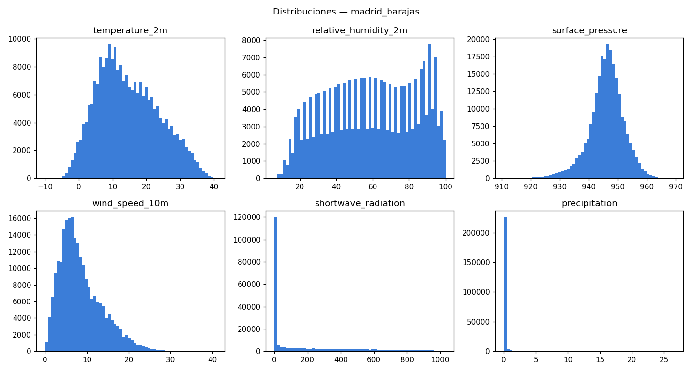
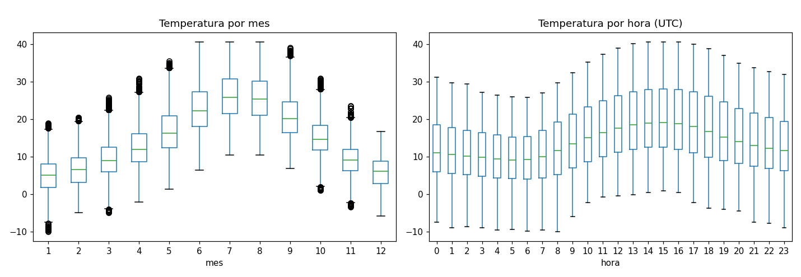
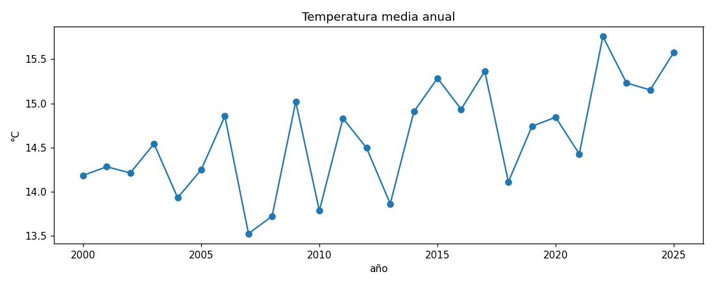

# FASE 2 — Data Understanding

**Proyecto:** Weather Intelligence  
**Ubicación:** Madrid-Barajas (40.4936, -3.5668)  
**Generado:** 2026-09-09T00:26:39+00:00

> Informe generado por `backend/ml/data_understanding.py` a partir de `data/raw/`. Reproducible: `python -m backend.ml.data_understanding`.

---

## 1. Dataset histórico principal — Open-Meteo / ERA5

- **Fuente:** Open-Meteo Historical Weather API (reanálisis ERA5, ECMWF/Copernicus)
- **Licencia:** CC BY 4.0
- **Descargado:** 2026-09-09T00:01:44+00:00
- **Celda de rejilla ERA5 real:** lat 40.52724, lon -3.5593262, elevación 618.0 m
- **SHA-256:** `54473c67b3c41870a23a902efd37cec57cb1c90f7c48eb6cfa6ffacfec30f593`

### 1.1 Cobertura temporal

- Rango: **2000-01-01T00:00:00+00:00** → **2026-09-05T23:00:00+00:00**
- Filas: **233,880**  (esperadas si fuese horario perfecto: 233,880)
- Cobertura horaria: **100.0 %**
- Timestamps ausentes: **0** en **0** tramo(s)
- Timestamps duplicados: **0**

### 1.2 Perfil por columna

| columna                    | dtype   |   nulos |   nulos_pct |   n_unicos | min   | p01    | p25    | mediana   | media                 | p75    | p99    | max    | std                  | rango_plausible   | fuera_de_rango   | fuera_de_dominio   | valores_observados                             |
|:---------------------------|:--------|--------:|------------:|-----------:|:------|:-------|:-------|:----------|:----------------------|:-------|:-------|:-------|:---------------------|:------------------|:-----------------|:-------------------|:-----------------------------------------------|
| temperature_2m             | float64 |       0 |           0 |        492 | -10.0 | -1.7   | 7.7    | 13.6      | 14.692474773388064    | 21.2   | 35.2   | 40.7   | 9.037431994761437    | [-25.0, 48.0]     | 0.0              | ·                  | ·                                              |
| relative_humidity_2m       | int64   |       0 |           0 |         95 | 6.0   | 14.0   | 39.0   | 60.0      | 59.048182828801096    | 81.0   | 98.0   | 100.0  | 24.285516080995844   | [0.0, 100.0]      | 0.0              | ·                  | ·                                              |
| dew_point_2m               | float64 |       0 |           0 |        370 | -19.8 | -7.4   | 1.9    | 5.3       | 5.011148452197708     | 8.5    | 14.9   | 23.4   | 4.876193073315809    | [-35.0, 30.0]     | 0.0              | ·                  | ·                                              |
| apparent_temperature       | float64 |       0 |           0 |        529 | -14.6 | -5.5   | 4.9    | 11.5      | 12.533338036599964    | 19.8   | 34.3   | 41.6   | 9.800479529362148    | [-35.0, 55.0]     | 0.0              | ·                  | ·                                              |
| surface_pressure           | float64 |       0 |           0 |        533 | 910.7 | 928.2  | 942.9  | 946.3     | 946.0120788438516     | 949.7  | 959.1  | 969.7  | 6.02724354252662     | [905.0, 972.0]    | 0.0              | ·                  | ·                                              |
| pressure_msl               | float64 |       0 |           0 |        586 | 981.9 | 1000.1 | 1013.3 | 1017.1    | 1017.5704878570208    | 1021.7 | 1034.1 | 1044.9 | 6.84066201806215     | [975.0, 1050.0]   | 0.0              | ·                  | ·                                              |
| precipitation              | float64 |       0 |           0 |         82 | 0.0   | 0.0    | 0.0    | 0.0       | 0.05359329570720027   | 0.0    | 1.3    | 26.7   | 0.2872820351121899   | [0.0, 60.0]       | 0.0              | ·                  | ·                                              |
| rain                       | float64 |       0 |           0 |         82 | 0.0   | 0.0    | 0.0    | 0.0       | 0.05248246964255174   | 0.0    | 1.3    | 26.7   | 0.2844390810554925   | [0.0, 60.0]       | 0.0              | ·                  | ·                                              |
| snowfall                   | float64 |       0 |           0 |         26 | 0.0   | 0.0    | 0.0    | 0.0       | 0.0007946382760389945 | 0.0    | 0.0    | 1.96   | 0.021723684208629575 | [0.0, 30.0]       | 0.0              | ·                  | ·                                              |
| cloud_cover                | int64   |       0 |           0 |        101 | 0.0   | 0.0    | 1.0    | 34.0      | 43.630336069779375    | 89.0   | 100.0  | 100.0  | 40.098409326448845   | [0.0, 100.0]      | 0.0              | ·                  | ·                                              |
| cloud_cover_low            | int64   |       0 |           0 |        101 | 0.0   | 0.0    | 0.0    | 0.0       | 16.720655891910383    | 18.0   | 100.0  | 100.0  | 30.152678289309847   | [0.0, 100.0]      | 0.0              | ·                  | ·                                              |
| cloud_cover_mid            | int64   |       0 |           0 |        101 | 0.0   | 0.0    | 0.0    | 2.0       | 19.523456473405165    | 29.0   | 100.0  | 100.0  | 29.99023063181142    | [0.0, 100.0]      | 0.0              | ·                  | ·                                              |
| cloud_cover_high           | int64   |       0 |           0 |        101 | 0.0   | 0.0    | 0.0    | 2.0       | 28.681678638618095    | 62.0   | 100.0  | 100.0  | 38.208911159173795   | [0.0, 100.0]      | 0.0              | ·                  | ·                                              |
| wind_speed_10m             | float64 |       0 |           0 |        369 | 0.0   | 0.8    | 4.8    | 7.4       | 8.576657260133402     | 11.5   | 24.1   | 40.9   | 5.1924818056170805   | [0.0, 130.0]      | 0.0              | ·                  | ·                                              |
| wind_direction_10m         | int64   |       0 |           0 |        361 | 0.0   | 4.0    | 41.0   | 180.0     | 157.92106208311955    | 238.0  | 360.0  | 360.0  | 109.36943949700397   | [0.0, 360.0]      | 0.0              | ·                  | ·                                              |
| wind_gusts_10m             | float64 |       0 |           0 |        248 | 0.7   | 5.0    | 12.6   | 18.4      | 21.060781169830683    | 27.4   | 54.7   | 101.2  | 11.154336093008439   | [0.0, 180.0]      | 0.0              | ·                  | ·                                              |
| wind_speed_100m            | float64 |       0 |           0 |        563 | 0.0   | 1.3    | 7.7    | 13.4      | 14.566331879596373    | 20.2   | 37.7   | 65.7   | 8.546654896092482    | [0.0, 160.0]      | 0.0              | ·                  | ·                                              |
| shortwave_radiation        | float64 |       0 |           0 |       1019 | 0.0   | 0.0    | 0.0    | 10.0      | 199.21010347186592    | 363.0  | 946.0  | 1031.0 | 279.3473218209421    | [0.0, 1100.0]     | 0.0              | ·                  | ·                                              |
| direct_radiation           | float64 |       0 |           0 |        898 | 0.0   | 0.0    | 0.0    | 1.0       | 144.09455276210022    | 231.0  | 820.0  | 906.0  | 227.51954330740173   | [0.0, 1000.0]     | 0.0              | ·                  | ·                                              |
| diffuse_radiation          | float64 |       0 |           0 |        453 | 0.0   | 0.0    | 0.0    | 7.0       | 55.11555070976569     | 101.0  | 300.0  | 469.0  | 73.02479327576194    | [0.0, 750.0]      | 0.0              | ·                  | ·                                              |
| et0_fao_evapotranspiration | float64 |       0 |           0 |         98 | 0.0   | 0.0    | 0.01   | 0.06      | 0.14815435265948346   | 0.22   | 0.74   | 0.97   | 0.19371837047061527  | [-0.2, 2.5]       | 0.0              | ·                  | ·                                              |
| weather_code               | int64   |       0 |           0 |         13 | ·     | ·      | ·      | ·         | ·                     | ·      | ·      | ·      | ·                    | ·                 | ·                | 0.0                | 0, 1, 2, 3, 51, 53, 55, 61, 63, 65, 71, 73, 75 |
| is_day                     | int64   |       0 |           0 |          2 | ·     | ·      | ·      | ·         | ·                     | ·      | ·      | ·      | ·                    | ·                 | ·                | 0.0                | 0, 1                                           |

---

## 2. Dataset de contraste — estación real (Meteostat)

- **Estación:** Meteostat — estación 08221 (Madrid / Barajas)
- **Identificadores:** {'wmo': '08221', 'icao': 'LEMD', 'iata': 'MAD', 'ghcn': 'SPE00120278', 'usaf': '082210', 'mosmix': '08221'}
- **Ubicación estación:** {'latitude': 40.45, 'longitude': -3.55, 'elevation': 609}
- Rango: **2000-01-01T00:00:00+00:00** → **2026-03-29T22:00:00+00:00**
- Filas: **228,281** — cobertura horaria **99.236 %** (1,758 horas ausentes)

### 2.1 Perfil por columna (estación)

| columna   | dtype   |   nulos |   nulos_pct |   n_unicos | min   | p01   | p25    | mediana   | media                | p75    | p99    | max    | std                | rango_plausible   |   fuera_de_rango |
|:----------|:--------|--------:|------------:|-----------:|:------|:------|:-------|:----------|:---------------------|:-------|:-------|:-------|:-------------------|:------------------|-----------------:|
| temp      | float64 |     266 |       0.117 |        522 | -12.7 | -2.2  | 8.1    | 14.0      | 15.094884547069269   | 21.6   | 36.0   | 42.4   | 9.232559872697312  | [-25.0, 48.0]     |                0 |
| dwpt      | float64 |     360 |       0.158 |        394 | -22.0 | -7.6  | 1.8    | 5.4       | 5.105546658710693    | 8.7    | 15.3   | 24.0   | 5.049502696597994  | [-35.0, 30.0]     |                0 |
| rhum      | float64 |     360 |       0.158 |        108 | 5.0   | 13.0  | 38.0   | 59.0      | 58.31188438099166    | 81.0   | 100.0  | 152.0  | 24.56598308644313  | [0.0, 100.0]      |               31 |
| prcp      | float64 |  195492 |      85.6   |         69 | 0.0   | 0.0   | 0.0    | 0.0       | 0.05713196498825826  | 0.0    | 1.6    | 13.9   | 0.3483463037117088 | [0.0, 120.0]      |                0 |
| snow      | float64 |  225711 |      98.9   |          2 | 0.0   | 0.0   | 0.0    | 0.0       | 0.038910505836575876 | 0.0    | 0.0    | 100.0  | 1.972574607881179  | [0.0, 2000.0]     |                0 |
| wdir      | float64 |   16297 |       7.14  |        347 | 0.0   | 0.0   | 120.0  | 210.0     | 204.44605724960374   | 320.0  | 360.0  | 360.0  | 115.22978506301737 | [0.0, 360.0]      |                0 |
| wspd      | float64 |     575 |       0.252 |        104 | 0.0   | 0.0   | 5.4    | 7.6       | 10.35236840487295    | 14.8   | 35.3   | 87.1   | 7.797549872157281  | [0.0, 160.0]      |                0 |
| wpgt      | float64 |  207306 |      90.8   |         31 | 0.0   | 7.4   | 11.1   | 13.0      | 16.24182598331347    | 20.4   | 38.9   | 64.8   | 7.315637453590835  | [0.0, 220.0]      |                0 |
| pres      | float64 |   36049 |      15.8   |        612 | 980.5 | 999.7 | 1012.4 | 1016.6    | 1017.2690993174915   | 1021.8 | 1035.6 | 1047.4 | 7.4512449372460505 | [975.0, 1050.0]   |                0 |
| tsun      | float64 |  228281 |     100     |          0 | ·     | ·     | ·      | ·         | ·                    | ·      | ·      | ·      | ·                  | [0.0, 60.0]       |                0 |
| coco      | float64 |  158315 |      69.4   |         19 | 0.0   | 1.0   | 1.0    | 2.0       | 2.523039762170197    | 3.0    | 17.0   | 26.0   | 2.4995629144200726 | —                 |                0 |

### 2.2 Contraste ERA5 vs estación (horas coincidentes)

| variable                    |   n_horas_comunes |   sesgo_medio (ERA5-est.) |   MAE |   RMSE |   correlacion_pearson |
|:----------------------------|------------------:|--------------------------:|------:|-------:|----------------------:|
| Temperatura (°C)            |            228015 |                    -0.551 |  1.31 |   1.68 |                 0.985 |
| Punto de rocío (°C)         |            227921 |                    -0.118 |  1.34 |   1.82 |                 0.933 |
| Humedad relativa (%)        |            227921 |                     1.08  |  6.19 |   8.44 |                 0.941 |
| Velocidad del viento (km/h) |            227706 |                    -1.75  |  4.26 |   5.7  |                 0.721 |
| Presión nivel del mar (hPa) |            192232 |                     0.309 |  1.05 |   1.36 |                 0.986 |

> Un sesgo pequeño y una correlación alta indican que ERA5 representa bien la ubicación para esa variable. La precipitación y el viento suelen concordar peor que la temperatura (esperado; ver fase-1 §7 limitaciones).

---

## 3. Figuras

---

## 4. Conclusiones de Data Understanding

- El dataset principal cubre **100.0 %** de las horas entre 2000-01-01 y 2026-09-05 (233,880 registros) → **supera el mínimo de 50.000** exigido en los criterios de éxito (§21).
- ERA5 (Open-Meteo): **sin nulos, sin duplicados, sin huecos**; solo **0** valores fuera del rango plausible (revisar en fase 3: probablemente extremos reales, no errores). Serie regular horaria → ETL directo.
- Estación real (Meteostat): cobertura 99.236 %. Columnas **vacías** (descartar): ['tsun']. Columnas **muy incompletas**: ['prcp', 'snow', 'wpgt', 'coco']. Columnas con valores fuera de rango (limpiar en fase 3): ['rhum'].
- **Contraste ERA5 ↔ estación (temperatura):** sesgo -0.551 °C, MAE 1.311 °C, correlación 0.9853. ERA5 representa muy bien la temperatura; el viento es la variable con peor acuerdo (esperado, fase-1 §7).

**Q-gate fase 2:** ✅ dataset ≥ 50.000 registros perfilado, diccionario de datos (`docs/diccionario-de-datos.md`), esquema PostgreSQL (migración Alembic `d3ba39744a07`) y ETL idempotente (`python -m backend.app.services.etl.load_historical`) → 233 880 filas en `weather_observations`.

**Siguiente (fase 3):** Data Preparation — limpieza, *feature engineering* (lags, medias móviles, codificación cíclica), partición cronológica y EDA.
