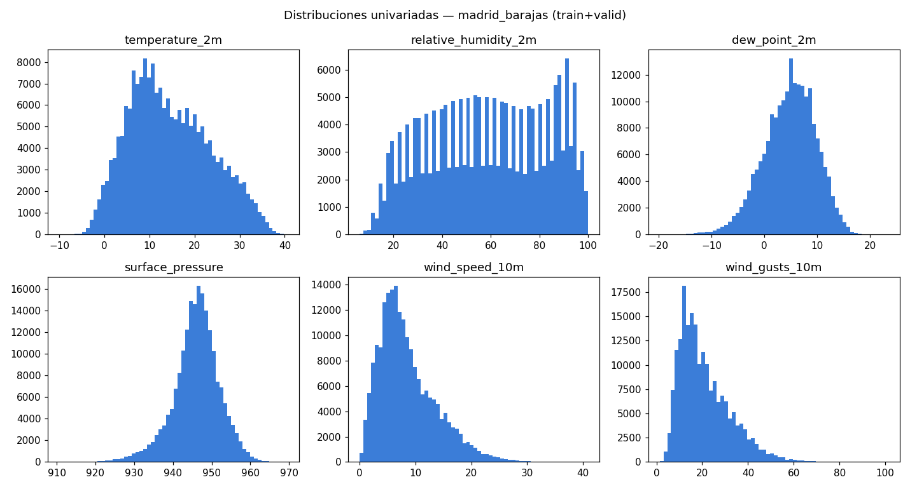
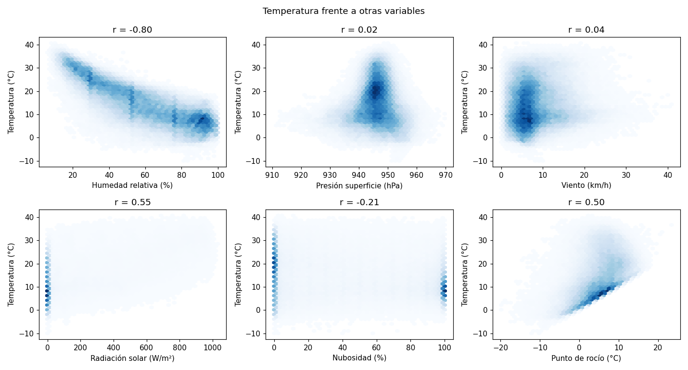
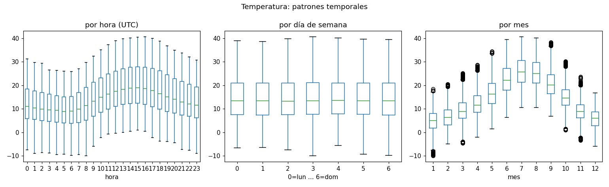
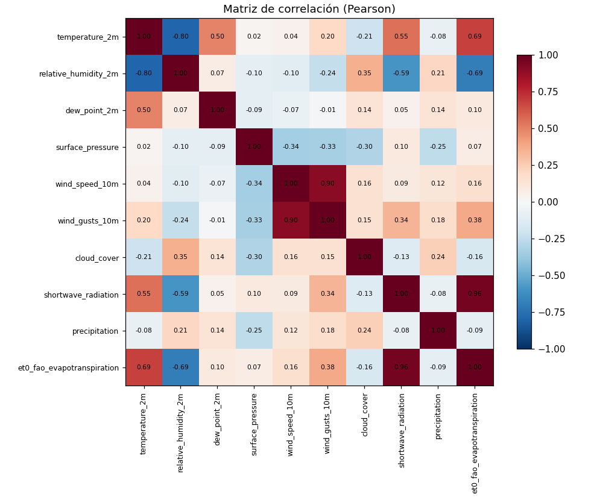

# FASE 3 — Análisis Exploratorio de Datos (EDA)

**Ubicación:** Madrid-Barajas  ·  **Datos:** train + valid (2000-01-02 → 2022-09-06, 198,777 filas)  ·  **Generado:** 2026-09-09T00:37:38+00:00

> El tramo de **test** se reserva para la fase 5 y no se analiza aquí (evita sesgar decisiones de modelado). Reproducible: `python -m backend.ml.eda`.

---

## 1. Análisis univariado

| variable                   |    media |   mediana |     std |        var |   min |   p05 |    p25 |    p75 |   p95 |        max |
|:---------------------------|---------:|----------:|--------:|-----------:|------:|------:|-------:|-------:|------:|-----------:|
| temperature_2m             |  14.5    |     13.4  |   8.98  |  80.6      | -10   |   1.3 |   7.6  |  21    |  30.7 |  40.7      |
| relative_humidity_2m       |  58.8    |     59    |  24     | 577        |   6   |  20   |  39    |  80    |  94   | 100        |
| dew_point_2m               |   4.83   |      5.2  |   4.87  |  23.7      | -19.8 |  -3.6 |   1.7  |   8.3  |  12.3 |  23.4      |
| surface_pressure           | 946      |    946    |   6.04  |  36.4      | 911   | 935   | 943    | 950    | 955   | 970        |
| wind_speed_10m             |   8.57   |      7.4  |   5.14  |  26.4      |   0   |   2.1 |   4.8  |  11.4  |  18.5 |  40.9      |
| wind_gusts_10m             |  21.1    |     18.4  |  11.1   | 124        |   1.4 |   7.9 |  12.6  |  27.4  |  42.5 | 101        |
| cloud_cover                |  42.9    |     33    |  39.6   |   1.57e+03 |   0   |   0   |   1    |  87    | 100   | 100        |
| shortwave_radiation        | 199      |     11    | 279     |   7.8e+04  |   0   |   0   |   0    | 363    | 816   |   1.03e+03 |
| precipitation              |   0.0508 |      0    |   0.265 |   0.0704   |   0   |   0   |   0    |   0    |   0.3 |  26.7      |
| et0_fao_evapotranspiration |   0.148  |      0.06 |   0.193 |   0.0372   |   0   |   0   |   0.01 |   0.22 |   0.6 |   0.96     |

**Lectura:**
- `temperature_2m`: distribución ancha (std ≈ 9 °C) por el fuerte ciclo anual; ligeramente asimétrica hacia valores altos en verano.
- `precipitation` y `shortwave_radiation`: fuertemente asimétricas a la derecha (muchos ceros: horas sin lluvia / de noche). No se deben normalizar de forma ingenua.
- `surface_pressure`: casi simétrica y estrecha (std ≈ 6 hPa).

---

## 2. Análisis bivariado (frente a la temperatura)

| relación                               | descripción              |   pearson |   spearman |
|:---------------------------------------|:-------------------------|----------:|-----------:|
| temperature_2m vs relative_humidity_2m | Humedad relativa (%)     |   -0.795  |    -0.781  |
| temperature_2m vs surface_pressure     | Presión superficie (hPa) |    0.0243 |    -0.0129 |
| temperature_2m vs wind_speed_10m       | Viento (km/h)            |    0.0431 |     0.0605 |
| temperature_2m vs shortwave_radiation  | Radiación solar (W/m²)   |    0.551  |     0.492  |
| temperature_2m vs cloud_cover          | Nubosidad (%)            |   -0.207  |    -0.215  |
| temperature_2m vs dew_point_2m         | Punto de rocío (°C)      |    0.498  |     0.533  |

**Lectura:**
- **Humedad relativa:** correlación negativa moderada — el aire más cálido admite más vapor, así que a igual humedad absoluta la relativa baja.
- **Radiación solar:** correlación positiva — más radiación calienta la superficie, pero la relación está mediada por la hora del día y la estación.
- **Punto de rocío:** correlación positiva fuerte (comparten la componente estacional).
- La relación con la **presión** y el **viento** es débil y no lineal.

---

## 3. Análisis temporal

- **Ciclo diario:** mínimo hacia las 06:00 UTC (9.4 °C), máximo hacia las 15:00 UTC (20.0 °C). Amplitud media ≈ 10.6 °C.
- **Ciclo anual:** mes más frío = 1 (4.9 °C), más cálido = 7 (25.9 °C).
- **Día de la semana:** sin patrón relevante (el clima no sabe si es lunes) — sirve como comprobación de que no hay artefactos de muestreo.

---

## 4. Correlaciones

Matriz de correlación de Pearson entre variables crudas:

|                            |   temperature_2m |   relative_humidity_2m |   dew_point_2m |   surface_pressure |   wind_speed_10m |   wind_gusts_10m |   cloud_cover |   shortwave_radiation |   precipitation |   et0_fao_evapotranspiration |
|:---------------------------|-----------------:|-----------------------:|---------------:|-------------------:|-----------------:|-----------------:|--------------:|----------------------:|----------------:|-----------------------------:|
| temperature_2m             |           1      |                -0.795  |         0.498  |             0.0243 |           0.0431 |           0.197  |        -0.207 |                0.551  |         -0.0769 |                       0.687  |
| relative_humidity_2m       |          -0.795  |                 1      |         0.0747 |            -0.101  |          -0.103  |          -0.24   |         0.353 |               -0.59   |          0.211  |                      -0.689  |
| dew_point_2m               |           0.498  |                 0.0747 |         1      |            -0.0905 |          -0.0651 |          -0.0109 |         0.137 |                0.0466 |          0.135  |                       0.0953 |
| surface_pressure           |           0.0243 |                -0.101  |        -0.0905 |             1      |          -0.339  |          -0.335  |        -0.3   |                0.0968 |         -0.251  |                       0.0738 |
| wind_speed_10m             |           0.0431 |                -0.103  |        -0.0651 |            -0.339  |           1      |           0.904  |         0.156 |                0.09   |          0.122  |                       0.16   |
| wind_gusts_10m             |           0.197  |                -0.24   |        -0.0109 |            -0.335  |           0.904  |           1      |         0.154 |                0.336  |          0.175  |                       0.382  |
| cloud_cover                |          -0.207  |                 0.353  |         0.137  |            -0.3    |           0.156  |           0.154  |         1     |               -0.127  |          0.24   |                      -0.158  |
| shortwave_radiation        |           0.551  |                -0.59   |         0.0466 |             0.0968 |           0.09   |           0.336  |        -0.127 |                1      |         -0.0759 |                       0.96   |
| precipitation              |          -0.0769 |                 0.211  |         0.135  |            -0.251  |           0.122  |           0.175  |         0.24  |               -0.0759 |          1      |                      -0.0877 |
| et0_fao_evapotranspiration |           0.687  |                -0.689  |         0.0953 |             0.0738 |           0.16   |           0.382  |        -0.158 |                0.96   |         -0.0877 |                       1      |

**Variables más correlacionadas con la temperatura** (|Pearson|):

| variable                   |   pearson |
|:---------------------------|----------:|
| relative_humidity_2m       |    -0.795 |
| et0_fao_evapotranspiration |     0.687 |
| shortwave_radiation        |     0.551 |
| dew_point_2m               |     0.498 |
| cloud_cover                |    -0.207 |
| wind_gusts_10m             |     0.197 |
| precipitation              |    -0.077 |
| wind_speed_10m             |     0.043 |
| surface_pressure           |     0.024 |

> ⚠️ **Correlación no implica causalidad.** Muchas de estas relaciones están confundidas por variables comunes (hora del día, estación del año): por ejemplo, radiación y temperatura suben juntas porque ambas dependen de la posición solar, no porque una cause directamente a la otra en estos datos.

---

## 5. Figuras

---

## 6. Conclusiones para el modelado (fase 5)

- La temperatura está dominada por dos ciclos (diario y anual) → las features cíclicas (`hour_sin/cos`, `doy_sin/cos`) y los lags de 24 h deberían ser muy informativos.
- La persistencia (`temperature_2m_lag_1h`) será un *baseline* fuerte a horizontes cortos; el reto está en 6–24 h.
- Variables muy asimétricas (precipitación, radiación) conviene tratarlas con transformaciones suaves o usarlas vía agregados (`precipitation_roll_sum_*`).
- No hay señal por día de semana → no se incluye `dayofweek` como predictor fuerte (se deja por control).
