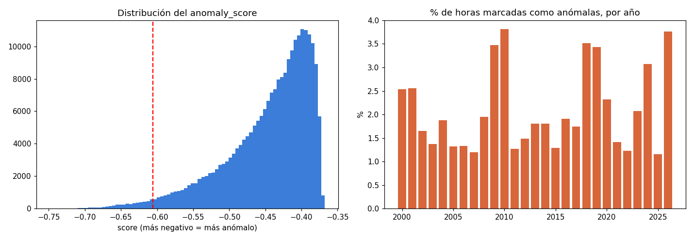

# FASE 4 — Minería de datos: Detección de anomalías

**Ubicación:** Madrid-Barajas · **Método:** Isolation Forest sobre residuales des-estacionalizados · **contamination = 0.02** · **Generado:** 2026-09-09T00:49:08+00:00

> Climatología y modelo ajustados con *train* (2000–2018). Reproducible: `python -m backend.ml.mining.run_anomalies`.


---

## 1. Planteamiento

Aplicar Isolation Forest a la temperatura cruda marcaría casi todo el verano como anómalo (está lejos de la media anual). En su lugar se usan **residuales**:

```
residual = valor observado − media histórica de ese (mes, hora)
```

Variables usadas: temperature_2m, relative_humidity_2m, surface_pressure, wind_speed_10m. Así 'anómalo' = *inusual para esa época del año y hora del día*.


---

## 2. Resultados

- Observaciones puntuadas: **233,880**
- Marcadas como potencialmente anómalas: **4,838** (2.07 %)
- Umbral de score: -0.6060 (por debajo → anómalo)




---

## 3. Las 20 horas más anómalas

| timestamp        |   temperature_2m |   relative_humidity_2m |   surface_pressure |   wind_speed_10m |   anomaly_score |
|:-----------------|-----------------:|-----------------------:|-------------------:|-----------------:|----------------:|
| 2023-10-19 15:00 |             17.1 |                     91 |              920.9 |             33.7 |           -0.75 |
| 2023-10-19 14:00 |             17.6 |                     90 |              920.3 |             31.9 |           -0.75 |
| 2008-10-31 14:00 |              8.8 |                     92 |              921.3 |              2.1 |           -0.74 |
| 2023-10-19 13:00 |             17.5 |                     89 |              921.6 |             39.1 |           -0.74 |
| 2008-10-31 13:00 |              9   |                     92 |              922.3 |              1.5 |           -0.74 |
| 2001-03-02 12:00 |             11.9 |                     92 |              920.4 |             34.5 |           -0.74 |
| 2023-10-19 12:00 |             17.2 |                     91 |              922.8 |             35.8 |           -0.74 |
| 2002-11-14 15:00 |              5.8 |                     98 |              917.5 |              0.8 |           -0.73 |
| 2008-10-31 15:00 |              8.6 |                     93 |              921   |              5.8 |           -0.73 |
| 2008-10-31 12:00 |              9.1 |                     93 |              923.5 |              2.4 |           -0.73 |
| 2015-09-16 15:00 |             18   |                     83 |              933.7 |             27.4 |           -0.73 |
| 2017-12-11 02:00 |             10.4 |                     88 |              920.2 |             34.3 |           -0.72 |
| 2009-12-24 10:00 |             12.1 |                     95 |              917   |             28.6 |           -0.72 |
| 2019-12-20 02:00 |             12.9 |                     88 |              925.6 |             39.7 |           -0.72 |
| 2017-12-11 03:00 |             10.5 |                     89 |              919.1 |             31.4 |           -0.72 |
| 2008-10-31 16:00 |              8.4 |                     93 |              921.1 |             12.7 |           -0.72 |
| 2018-03-02 16:00 |              7.8 |                     92 |              923.5 |              2.5 |           -0.72 |
| 2018-03-02 17:00 |              7.9 |                     93 |              922.2 |              1   |           -0.72 |
| 2010-02-27 17:00 |             18.3 |                     47 |              921.3 |             39.8 |           -0.72 |
| 2003-10-31 14:00 |             11.3 |                     58 |              917.9 |             26.2 |           -0.72 |

---

## 4. Interpretación responsable

- Una anomalía estadística significa **"valor inusual respecto al histórico"**, **no** necesariamente un fenómeno climático extremo ni un error de medición.
- El modelo detecta combinaciones raras (p. ej. mucho calor con presión muy baja y viento fuerte a la vez), no valores altos aislados.
- El umbral `contamination` es una **decisión operativa** (se marca ~2 % de las horas), no una verdad: subirlo o bajarlo cambia cuántas se señalan.


**Q-gate:** ✅ detección sobre residuales des-estacionalizados; salida con score y clasificación normal/anómalo; comunicación con matices.


**Siguiente (fase 5):** Machine Learning — predicción de temperatura.
