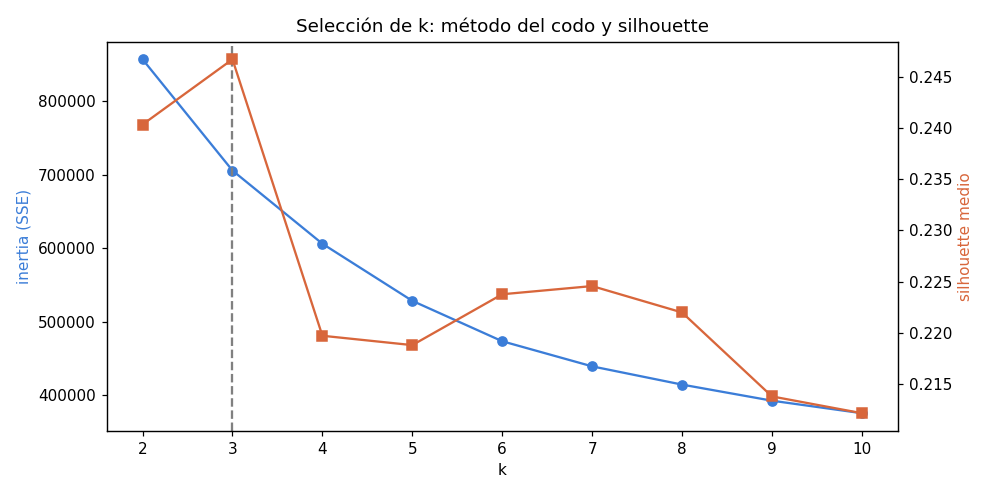
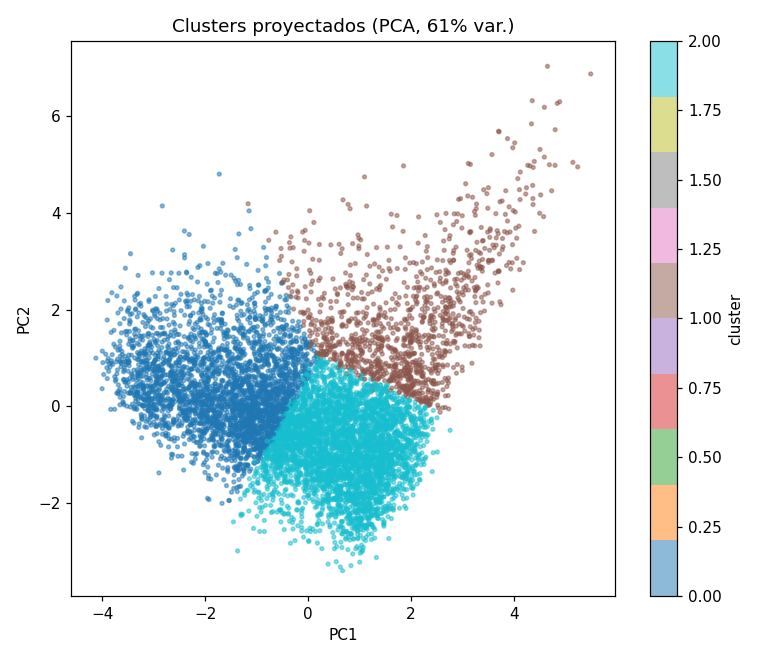
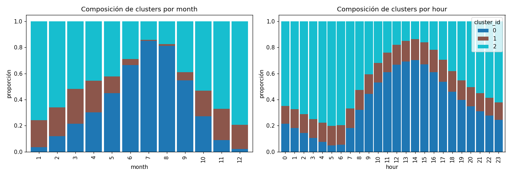

# FASE 4 — Minería de datos: Clustering de regímenes meteorológicos

**Ubicación:** Madrid-Barajas · **Algoritmo:** K-Means · **k = 3** · **Generado:** 2026-09-09T00:51:13+00:00

> Modelo ajustado con el tramo de *train* (2000–2018). Reproducible: `python -m backend.ml.mining.run_clustering`.

---

## 1. Selección del número de clusters

k=3 maximiza el silhouette medio (0.247). El método del codo (inertia vs k) se aporta como comprobación visual.

|   k |   inertia |   silhouette |
|----:|----------:|-------------:|
|   2 |    856948 |       0.2403 |
|   3 |    705692 |       0.2467 |
|   4 |    606142 |       0.2197 |
|   5 |    528468 |       0.2188 |
|   6 |    473517 |       0.2238 |
|   7 |    439364 |       0.2246 |
|   8 |    414559 |       0.222  |
|   9 |    392666 |       0.2138 |
|  10 |    375657 |       0.2121 |

> El silhouette es modesto (los datos meteorológicos son un continuo, no grupos bien separados), pero los clusters resultantes son **físicamente interpretables**, que es el criterio que importa aquí.

---

## 2. Interpretación de los clusters

Centroides en **unidades originales** (precipitación en mm tras deshacer el log):

|   cluster |     n |   pct | etiqueta                                          |   temperature_2m |   relative_humidity_2m |   surface_pressure |   wind_speed_10m |   cloud_cover |   shortwave_radiation |   precipitation |
|----------:|------:|------:|:--------------------------------------------------|-----------------:|-----------------------:|-------------------:|-----------------:|--------------:|----------------------:|----------------:|
|         0 | 60283 |  36.8 | cálido, seco, soleado                             |             23.4 |                   33.5 |              946.7 |              8.9 |          27.7 |                 426.8 |             0   |
|         1 | 24575 |  15   | frío, húmedo, nublado, ventoso, con precipitación |              9.6 |                   77.3 |              937.4 |             13.5 |          85.2 |                 109.3 |             0.2 |
|         2 | 78841 |  48.2 | frío, húmedo                                      |              9.1 |                   71.7 |              947.8 |              6.5 |          40.5 |                  54.9 |             0   |

**Etiquetas** (derivadas de la desviación del centroide respecto a la media global, no fijadas de antemano):

- **Cluster 0** (36.8 % de las horas): *cálido, seco, soleado* — 23.4 °C, 33.5 % HR, 27.7 % nubes, 426.8 W/m².
- **Cluster 1** (15.0 % de las horas): *frío, húmedo, nublado, ventoso, con precipitación* — 9.6 °C, 77.3 % HR, 85.2 % nubes, 109.3 W/m².
- **Cluster 2** (48.2 % de las horas): *frío, húmedo* — 9.1 °C, 71.7 % HR, 40.5 % nubes, 54.9 W/m².

---

## 3. Distribución temporal

Cada régimen aparece con mayor o menor frecuencia según el mes y la hora (p. ej. los regímenes cálidos y secos dominan en verano y de día). Esto es una **consecuencia** de los datos, no una entrada del modelo: el clustering no vio la fecha ni la hora.

---

## 4. Persistencia

- `cluster_models`: 1 fila (k=3, silhouette=0.2467, is_active=true)
- `cluster_assignments`: 233,880 filas (una por observación: cluster + distancia al centroide)
- artefacto: `backend/ml/artifacts/kmeans_madrid_barajas.joblib`

**Q-gate:** ✅ k elegido con Elbow+Silhouette y documentado; clusters interpretados desde los datos; asignaciones persistidas.

**Siguiente:** detección de anomalías (Isolation Forest sobre residuales).
