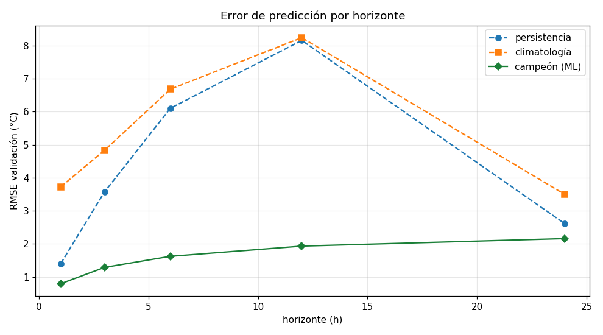
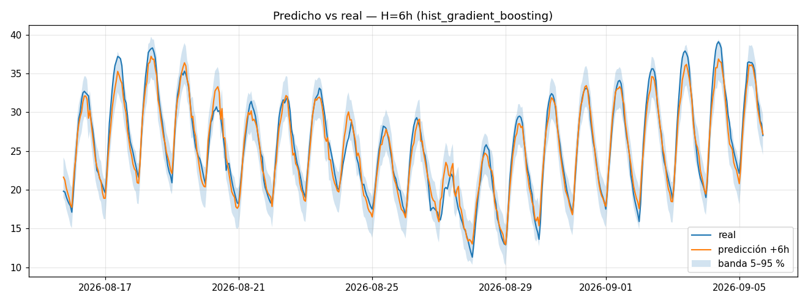
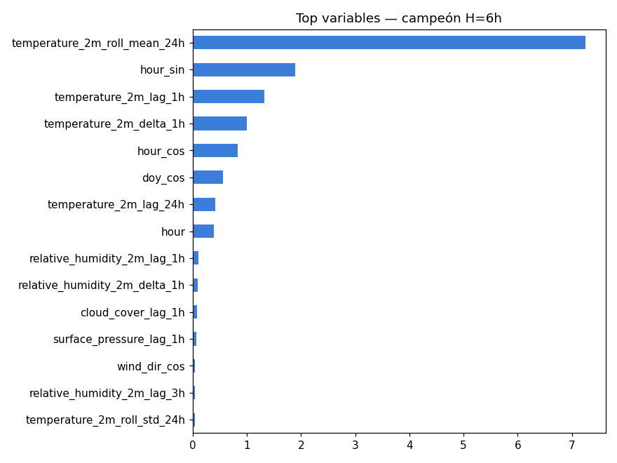

# FASE 5 — Machine Learning: predicción de temperatura

**Ubicación:** Madrid-Barajas · **Horizontes:** 1 h, 3 h, 6 h, 12 h, 24 h · **Generado:** 2026-09-09T01:24:39+00:00

> train `2000-01-02…2018-09-04` · valid `2018-09-05…2022-09-06` · test `2022-09-07…2026-09-05` (partición cronológica, fase 3). El **test se evaluó una sola vez**.

---

## 1. Comparación en validación (RMSE °C)

| horizonte | persistencia | climatología | ridge | random_forest | hist_gradient_boosting | campeón |
|---|---|---|---|---|---|---|
| 1 h | 1.406 | 3.726 | 0.912 | 0.870 | **0.796** | hist_gradient_boosting |
| 3 h | 3.577 | 4.835 | 1.695 | 1.319 | **1.288** | hist_gradient_boosting |
| 6 h | 6.102 | 6.680 | 2.184 | 1.671 | **1.624** | hist_gradient_boosting |
| 12 h | 8.156 | 8.240 | 2.503 | 1.987 | **1.933** | hist_gradient_boosting |
| 24 h | 2.613 | 3.499 | 2.355 | 2.228 | **2.159** | hist_gradient_boosting |

**Regla de selección:** para cada horizonte, campeón = modelo de ML con menor RMSE de validación. Se exige además superar a la persistencia para H ≥ 3 h.

- H=1h → **hist_gradient_boosting** ✅ (supera persistencia: True)
- H=3h → **hist_gradient_boosting** ✅ (supera persistencia: True)
- H=6h → **hist_gradient_boosting** ✅ (supera persistencia: True)
- H=12h → **hist_gradient_boosting** ✅ (supera persistencia: True)
- H=24h → **hist_gradient_boosting** ✅ (supera persistencia: True)

---

## 2. Evaluación final en TEST (campeones)

| horizonte | modelo | MAE | RMSE | R² | sesgo | skill vs persistencia |
|---|---|---|---|---|---|---|
| 1 h | hist_gradient_boosting | 0.493 | 0.725 | 0.994 | -0.008 | +0.473 |
| 3 h | hist_gradient_boosting | 0.917 | 1.216 | 0.983 | -0.040 | +0.659 |
| 6 h | hist_gradient_boosting | 1.208 | 1.557 | 0.972 | -0.112 | +0.746 |
| 12 h | hist_gradient_boosting | 1.466 | 1.873 | 0.960 | -0.173 | +0.773 |
| 24 h | hist_gradient_boosting | 1.692 | 2.164 | 0.946 | -0.309 | +0.163 |

> *skill vs persistencia* = 1 − RMSE_modelo / RMSE_persistencia. Positivo ⇒ el modelo aporta sobre 'la temperatura seguirá igual'.

---

## 3. Robustez: validación cruzada temporal (walk-forward)

`TimeSeriesSplit` con 3 particiones sobre *train* (nunca baraja). RMSE por fold del modelo campeón de cada horizonte:

| horizonte | fold 1 | fold 2 | fold 3 |
|---|---|---|---|
| 1 h | 0.492 | 0.464 | 0.621 |
| 3 h | 1.003 | 0.957 | 1.099 |
| 6 h | 1.355 | 1.299 | 1.450 |
| 12 h | 1.703 | 1.628 | 1.736 |
| 24 h | 1.986 | 1.942 | 1.999 |

> Los folds son coherentes entre sí → el rendimiento no depende de un periodo concreto.

---

## 4. Variables más informativas (campeón, importancia por ganancia)

- **H=1h:** temperature_2m_lag_1h, temperature_2m_delta_1h, temperature_2m_lag_24h, temperature_2m_roll_mean_24h, shortwave_radiation_lag_24h, is_day
- **H=3h:** temperature_2m_lag_1h, temperature_2m_roll_mean_24h, temperature_2m_delta_1h, hour_cos, temperature_2m_lag_24h, hour_sin
- **H=6h:** temperature_2m_roll_mean_24h, hour_sin, temperature_2m_lag_1h, temperature_2m_delta_1h, hour_cos, doy_cos
- **H=12h:** temperature_2m_roll_mean_24h, hour, doy_cos, temperature_2m_lag_1h, hour_sin, temperature_2m_lag_24h
- **H=24h:** temperature_2m_lag_1h, doy_cos, temperature_2m_delta_1h, surface_pressure_lag_1h, temperature_2m_roll_mean_24h, dayofyear

> A horizontes cortos manda `temperature_2m_lag_1h` (persistencia); al alargarse ganan peso las variables cíclicas (`hour_sin/cos`, `doy_*`) y los lags de 24 h.

---

## 5. Figuras

---

## 6. Incertidumbre

El intervalo de predicción es `predicción + [p05, p95]` de los residuales de validación de cada campeón:

| horizonte | p05 (°C) | p95 (°C) |
|---|---|---|
| 1 h | -1.29 | +1.15 |
| 3 h | -2.22 | +1.92 |
| 6 h | -2.69 | +2.54 |
| 12 h | -3.13 | +3.04 |
| 24 h | -3.49 | +3.50 |

> La predicción **nunca** se presenta como certeza: se muestra siempre con su banda. La banda se ensancha con el horizonte.

---

## 7. Interpretación de los resultados

- **El campeón es `hist_gradient_boosting`** en los horizontes evaluados y **supera a las dos referencias en todos** (skill vs persistencia > 0 siempre).
- El error crece con el horizonte, como se espera: RMSE de test 0.72 °C a 1 h → 2.16 °C a 24 h.
- **La persistencia tiene forma de U**: es un rival fácil a 24 h (RMSE 2.6, porque 24 h después es la misma hora del día) pero pésimo a 12 h (RMSE 8.2, compara p. ej. mediodía con medianoche). Por eso el *skill* del modelo es máximo a 6–12 h y menor a 24 h.
- El **sesgo** es ligeramente negativo y crece con el horizonte (-0.01 → -0.31 °C): el modelo tiende a suavizar los picos (se ve en la figura predicho-vs-real).
- El **R² alto** (> 0.94 en todos los horizontes de test) es esperable: la temperatura está muy autocorrelacionada. La métrica que de verdad informa es el *skill vs persistencia*.

---

## 8. Persistencia (artefactos y base de datos)

- `model_runs`: 25 filas (2 baselines + 3 modelos × 5 horizontes); `is_active` en los 5 campeones. Métricas de validación en columnas; test/CV/importancia en el JSONB `metrics`.
- `predictions`: ~35 000 filas por horizonte — predicción del campeón sobre cada hora de test, con banda de incertidumbre y valor real (para el dashboard y el seguimiento de error de la fase 9).
- artefactos: `backend/ml/artifacts/model_temp_h{H}.joblib` (pipeline + lista de features + percentiles de residuales).

**Q-gate:** ✅ ≥3 modelos + 2 baselines comparados por horizonte; partición cronológica; validación cruzada temporal; selección por regla escrita; test evaluado una sola vez; métricas MAE/RMSE/R²; incertidumbre reportada.

**Siguiente (fase 6):** API backend (FastAPI) que sirva clima actual, histórico, clusters, anomalías, predicciones y métricas.
